Devlog for my **Hack Club Horizons** hardware submission: a custom, wireless Bluetooth LE
macro keypad (12 keys + magnetic rotary encoder + OLED) built on an nRF52840
module and running ZMK.

Time is tracked with **Hackatime** (Wakatime → Hackatime) for firmware work since May.
Hardware/CAD/research sessions are recorded as **timelapses** (Lapse) and linked
per entry, since Lookout isn't supported for Horizons yet.

I actually started this project more than a year ago, and I've been documenting it the whole way — just not
in JOURNAL.md form. This file pulls all of that together into one devlog. It starts on May 23 because that's
the day I began tracking my time with Hackatime; plenty happened before then, I just wasn't logging the hours.

A few of these entries cover a work session that ran across more than one day — in that case the date is the
day the session wrapped up. 
To support me with much of the firmware work, especially debugging, I used Claude Code.
For the entries in which Claude Code was used, I placed the Claude code session name beneath the entry heading;
it doubles as the Git commit name for that chunk of work.


## Entries

#### May 23: Shorted my debugger probe - not my proudest journal entry

Back then I flashed firmware (M3) over SWD with a DAPLink probe instead of the UF2 bootloader (I moved to the
bootloader afterwards). Cortex-M 10-pin connector, pyocd, nothing fancy.

So one day I do the exact same thing I always do: connect the probe to the macro keyboard, kick off pyocd,
and... the progress bar just sits there and doesn't advance. No big deal — I unplug the probe, plug it back in,
re-run pyocd, and flash again.

And then the debugger probe starts smoking and then the little activity light that tells you something's happening 
just goes dark.

So what happened? Nothing was different from every other time I'd flashed this thing. The only way to
physically cook the probe like that is a mismatch on the connector pads. So I pulled up the schematic and
went pin by pin — the on-PCB connector vs. the probe's connector.

And then it hit me: I'd plugged the connector in from the *other* side of the PCB. Mirrored.
I did that because I couldn't reach the other side - and I just didn't think through that this 10 pin connector with
specific pins is not reversible like a USB port...

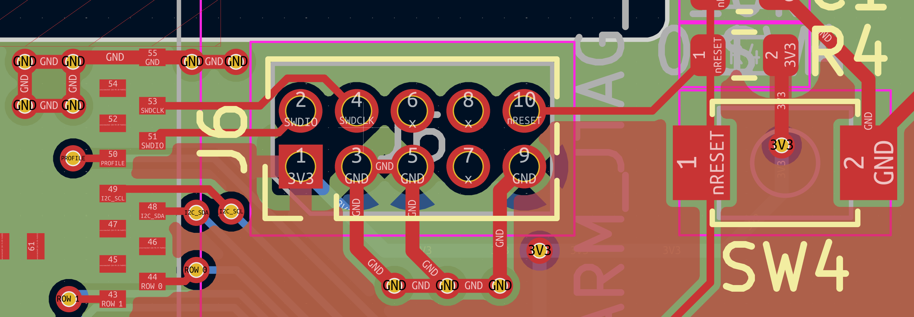

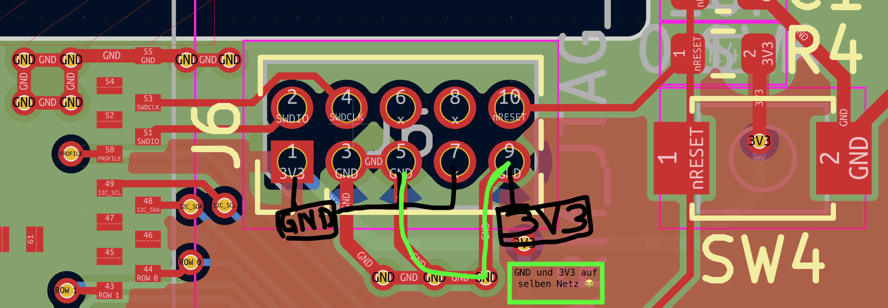

In the schematic you can see the nets that were *supposed* to line up, and (in my handwriting) the nets that
actually got connected once the plug was flipped around. Ground and 3V3 ended up on the same net → dead short
straight through the probe. Hence the smoke.

I reordered the debugger probe on amazon for 5€, so it could have been worse than just my probe shorting. If I 
shorted the keypad or (worse) my mac, this would have been WAY worse. It's still very embarrassing.

**tl;dr:** Flashed over SWD like always, but plugged the 10-pin Cortex-M connector in mirrored (from the wrong
side of the PCB). That put GND and 3V3 on the same net, shorted the probe, and let the debugger smoke. For the
future I will make sure to pay attention to the correct orientation of connectors.

**Time spent this session: 1.5 hours**


#### May 28: The OLED lights up, and takes Bluetooth down with it

*Milestone 4; Claude Code session: "Milestone 4: BUILT_IN screen"*

This was supposed to be the fun milestone: Turn the screen on, draw a status UI, done. Instead I learned that
on this board the display and the radio share a lifeline, and if you mess up the display the whole keyboard
will be messed up too.

Some context: the OLED bus had been switched off at the config level for a while because of an unrelated
power-delivery problem (Journal entry before this one) on the hardware side. That was finally sorted, so the plan 
was to bring the display up in firmware — in two steps. First get ZMK's *stock* status screen rendering, so that 
any problem is clearly the bus or the LVGL setup and not my own screen code. Then swap in my custom screen. 
Good call, because step one alone took two rounds.

**Quick explainer on what's actually stacked up behind this screen**, because "the display" is really four things
and every bug in this entry comes from different one:

- **The panel** — a 128×64 SSD1306 OLED, monochrome, talking over I2C. Monochrome here means *one bit per pixel*:
  a pixel is lit or it isn't, there is no grey. It's also addressed in 8-pixel-tall horizontal "pages" rather
  than row by row, which turns out to be a useful diagnostic later.
- **The Zephyr display driver** — knows how to push a buffer of pixels into that panel over I2C.
- **LVGL** — the graphics library that does the actual drawing (labels, boxes, fonts) into a buffer, then hands
  finished rectangles to the driver in what's called a *flush*.
- **ZMK's display layer** — decides *what* to draw: it defines a status screen and a set of widgets, and runs the
  whole thing on a **work queue** (a queue of jobs handled by a background thread).

That last word is the one to remember. By default the display's work runs on the *system* work queue — which is
the same queue ZMK uses for Bluetooth advertising and USB-HID transmits. Everything in Act 1 follows from that.

**Act 1: the screen lights up and shows TV static.**

I flipped `CONFIG_ZMK_DISPLAY` back on with the built-in screen, built it and flashed it. The OLED lit up and showed
pure snow. It was actual static, reshuffling artifacting (or idk how to call it) on every power cycle. Even worse was,
the board was dead with no USB enumeration, no Bluetooth advertising. Additionally my Mac started cooking itself, 
because the bad USB ejection left a couple of macOS processes running.


This is what the artifacting looked like on screen: 

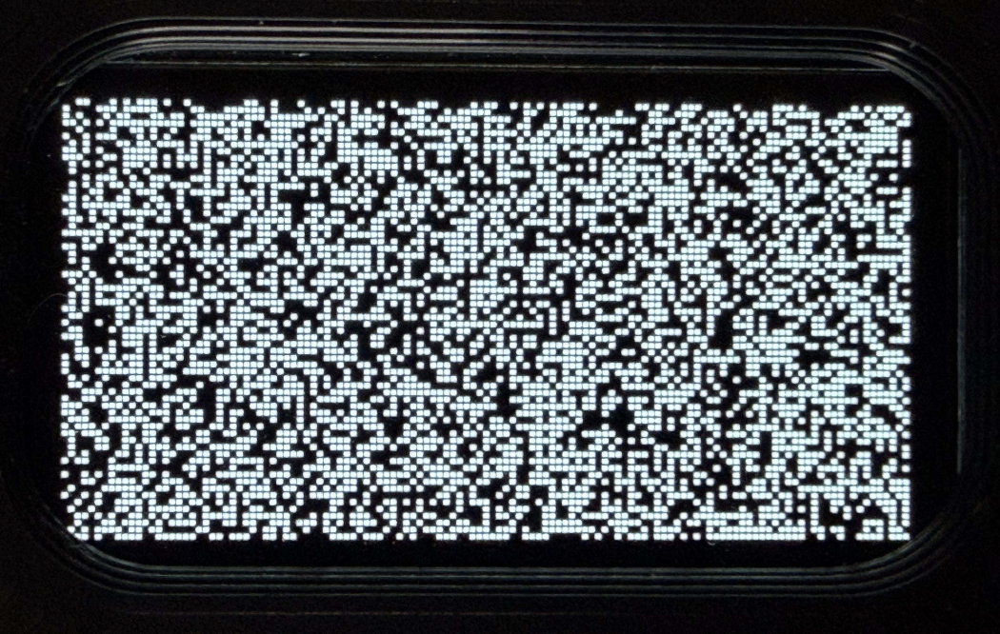

So what makes a 1bpp OLED show static *and* take the whole board down with it? Claude and I went through the
generated `.config`, and the problem was near the top:

```
CONFIG_LV_COLOR_DEPTH=16
CONFIG_LV_Z_BITS_PER_PIXEL=32
```

The panel is a monochrome SSD1306 — **one bit per pixel**. Zephyr's LVGL glue defaults to RGB565 at 32 bits per
pixel. Two things fall out of that single mismatch:

1. LVGL hands the SSD1306 driver fat 16-bit colour words, the driver writes them into display memory as raw
   bytes, and every "colour" becomes 16 unrelated pixels. That's the snow.
2. A 32bpp framebuffer for 128×64 is about 32 KB, roughly eight times the size of the LVGL memory pool. The
   first flush chokes on that — and it chokes *on the system work queue*, which is also where ZMK runs its
   Bluetooth advertising and USB-HID transmits. So the radio never got the chance to come up at all.

This doesn't only result in just a cosmetic problem, but it is a whole "your keyboard is now bricked" type problem,
because they ride the same queue. Very good.

Pinning the panel to 1bpp in the board's Kconfig is the fix — it's a property of the board, the OLED is soldered on,
and every upstream ZMK board with an SSD1306 does exactly this. Rebuilt both variants (I always build the plain one
*and* the ZMK Studio one, since a config change can pass one and break the other), flashed, and... still noise.

But the noise had *changed*. It was no longer full static, but it was organised into clean horizontal bands, 8 pixels
tall. The SSD1306 lays its memory out in 8-pixel-tall pages, so the panel was finally receiving structurally valid
1bpp data. LVGL just wasn't pushing a coherent frame yet. So Progress, not a win.

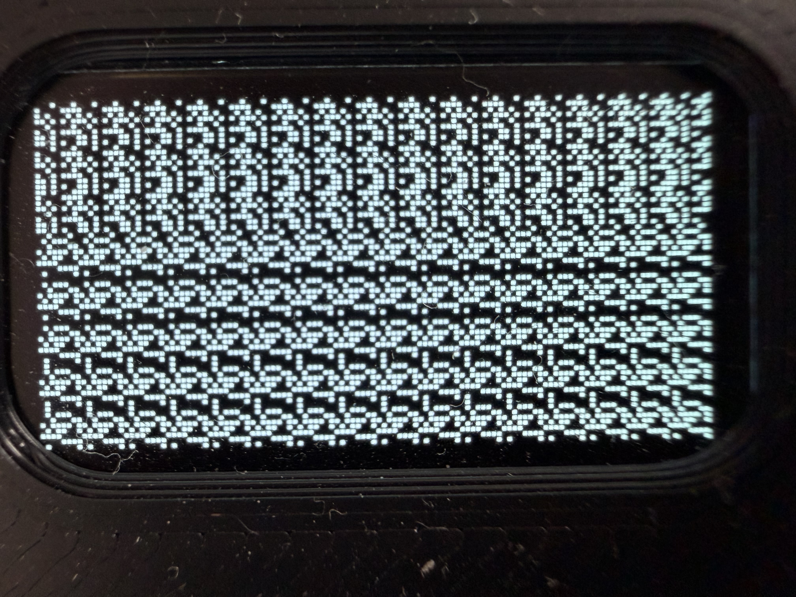

Round two, two changes, both of which just bring my board in line with what the established 128×64 SSD1306 ZMK
boards already do:

1. Give the display its **own** work queue instead of sharing the system one
2. Bump the LVGL draw buffer from 10% to 64% of the screen. The tiny default puts out lots of little partial
   flushes, faster than the I2C bus can serve them, which starves the display queue.

Flashed it, and **the stock screen came up.** Connection icon with the paired-device count, active profile,
battery indicator. USB enumerated, Bluetooth paired, ZMK Studio saw the board. Both changes were needed.

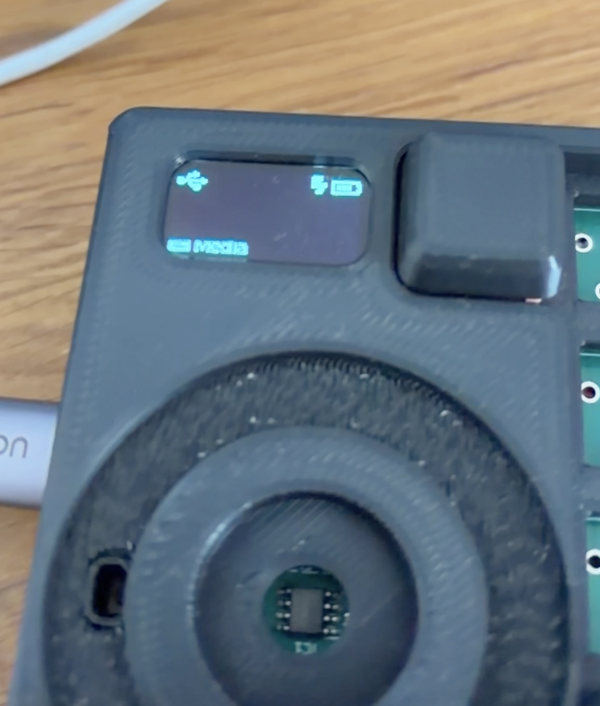

**Act 2: my own screen refuses to boot, and I lose (for now).**

The stock screen only really gives me battery plus the name of the current profile. What I want is all the
profiles at once with the active one highlighted.

One thing worth stating plainly here, since the rest of the journal leans on it: **a "profile" on this keyboard is
a ZMK layer.** ZMK keymaps are stacks of layers, each one its own set of key bindings, and my profile button just
activates the next one. So everything I call a profile — the boxes on the screen, the per-profile encoder mode,
the things Studio can add and delete later — is really a layer wearing a friendlier name. That's also why the
screen can just ask ZMK which layer is currently on top and trust the answer.

So I wrote the custom screen with this layout:
Battery top-right, four numbered slots/cells along the bottom, where the active slot inverted, refreshing whenever
the layer changes (because we can save some resources by not constantly checking change of state of particular
elements, but let the corresponding elements trigger a refresh). 

It built clean and flashed.

The static came straight back and the board was dead again. Yes of course.

Back into the config diff. The culprit this time looked obvious: choosing the *custom* screen silently drops a
pile of things the built-in screen quietly pulls in behind the scenes — specifically the mono theme and the
default font. Without the theme LVGL has no default font set, so the first text label renders against a null
font pointer and hardfaults. A hardfault takes the entire chip down, dedicated work queue or not, which is
exactly why Bluetooth and USB died alongside the display again.

So I pinned the theme and the fonts explicitly, and while I was in there fixed a polarity detail: this panel
reports its format such that LVGL "white" is actually an *off* pixel and "black" is a *lit* one, so my
inverted-slot colours were backwards. Confirmed in the compiled binary that the theme and both fonts were now
actually linked in. Built both variants, flashed —

And still static and still dead.

At that point I did the thing you do when you're sure and you're still wrong:  I stripped the screen down to the
absolute minimum:
create a screen, create one label and set its text, return. 
In the unlikely case that it boots, add pieces back one at a time until it breaks. And this basic screen with a
label still hung the board with a config that now matched the working built-in screen on every setting we'd found.

To be honest: I have no debug console wired to this board, so every hypothesis costs a full reflash-and-stare cycle 
with zero visibility into the actual fault.
Because it was already a long session, with a one-label screen still hanging and no obvious next suspect, the right
move wasn't to keep throwing firmware changes at it. So I reverted to the stock screen, which means I still have a 
fully working keyboard, and then wrote the entire state up for a Claude Code debugging session with every current
hypothesis and the config to reproduce it.

**tl;dr:** Brought the OLED up in firmware. The stock ZMK screen showed pure static and took USB + Bluetooth down
with it, because LVGL defaulted to 16/32-bit colour on a 1-bit panel and because the display shares a work queue
with the radio. Pinning the panel to 1bpp, giving the display its own work queue and enlarging the draw buffer got
the stock screen live and the board fully working. My *custom* screen still hardfaults at boot even stripped down
to a single label, so I stopped it with a full writeup and kept the working stock screen.

**Time spent this session: 12 hours**


#### May 29: The one Kconfig line I couldn't see

*Milestone 4 · Claude Code session: "Milestone 4: Custom screen"*

Picking up exactly where the last session died: the moment I flip to my custom status screen, the board hangs at
boot. The OLED shows 8-row-page garbage (that's just uninitialised display RAM), USB never enumerates, BLE never
advertises. And it does this *even with a minimal screen body*.

What made it so infuriating is that I'd already convinced myself the config was identical between the working
built-in screen and mine. Same mono theme, same font, same dedicated display work queue. So what's different?

I asked Claude for the hypotheses:
1. Something structural about how I create the screen object — maybe LVGL v9 changed the "right" way to build a
   custom screen and the built-in one does it differently.
2. A missing font/theme init that the built-in screen quietly does for me and I don't.
3. Some Kconfig symbol that the built-in screen implies and the custom path doesn't — something I *hadn't*
   actually checked, despite thinking I had.

So instead of guessing at #1 or #2, we went after #3: build the broken custom firmware *without* fixing anything,
and diff its generated `.config` against the known-good built-in one, line by line. Whatever's different is either
the cause or not, but at least it's ground truth instead of my own assumptions.

The diff was almost nothing. The screen-choice symbol flipped (expected), a couple of widgets the built-in screen
enables and mine doesn't (expected)... and one line I did *not* expect:

```
< CONFIG_LV_Z_MEM_POOL_SIZE=4096
> CONFIG_LV_Z_MEM_POOL_SIZE=2048
```

There it is. The built-in screen was getting a 4096-byte LVGL memory pool; my custom screen was getting 2048. The
why is in ZMK's own display Kconfig:

```
config LV_Z_MEM_POOL_SIZE
    default 4096 if ZMK_DISPLAY_STATUS_SCREEN_BUILT_IN
```

That `if` is the whole story. ZMK bumps the pool to 4096 **only** for its built-in screen. Pick the custom screen
and you silently fall back to Zephyr's default of 2048 — and 2048 isn't enough to allocate the mono theme plus a
screen object plus a single label. LVGL's allocator returns NULL, the very next line dereferences it, and the
display thread takes a hardfault. Because that happens during init, where a bunch of other work is queued, it
drags USB and BLE down with it. Which is also why the "dedicated work queue is supposed to protect BLE/USB"
reasoning never saved me: the problem wasn't a *stall* the queue could isolate, it was a *crash*.

The fix is one line in my board's `Kconfig.defconfig`, pinning the pool to 4096 under `if LVGL` so it applies no
matter which screen I pick. Rebuilt both variants clean, flashed it. 

And the OLED showed my label! The board enumerated over USB, was BLE paired and configurable over ZMK Studio.

After all that, the actual bug was a default value hidden behind an `if` I never thought to look inside.
Lesson: When two builds "should be identical", but aren't behaving identically, diff the generated config instead
of comparing the config you have written to define your board/or its functionality in the toolchain.

**tl;dr:** My custom OLED screen hung the whole board at boot (no USB, no BLE) even with a one-label body. I was
sure the config matched the working built-in screen — it didn't. Diffing the generated `.config` showed ZMK only
bumps `LV_Z_MEM_POOL_SIZE` to 4096 for its *built-in* screen; the custom path falls back to 2048, too small for
theme + screen + label, so LVGL handed back NULL and the display thread hardfaulted. Pinned the pool to 4096 in
my board config and the custom screen finally boots.

**Time spent this session: 7 hours**


#### May 30: Making my custom screen do its job

*Milestone 4 · Claude Code session: "Milestone 4: Custom screen"*

With the custom screen finally *booting*, this session was about making it do its job: show the battery (icon +
charging bolt + percentage) and show all my profiles as a set of boxes with the active one clearly marked. Sounds
like an afternoon. It was not an afternoon, because this little 1-bpp OLED had two surprises.

I wired the widgets up the proper ZMK way: each piece uses ZMK's display-listener macro, so state changes get
marshalled safely onto the display work queue, the same pattern the stock widgets use. Battery subscribes to
battery and USB events; the profile row subscribes to layer changes and reads the active profile straight from
`zmk_keymap_highest_layer_active()` — the same source my profile-cycle button advances, so the two can't
disagree. Flashed it and...

...the board hung again. Same garbage-on-screen, no-enumerate symptom as last session. But I knew this one
instantly, because I just spent seven hours learning it: the real screen has far more LVGL objects than my
one-label test, and 4096 wasn't enough for *it* either. Bumped the pool to 8192 and it came up. (I'm now paying a
kilobyte or two of RAM for headroom, which on a 256 KB part I will happily pay.)

And then the fun started.

**Surprise one: everything was the wrong colour.** White background, the "unselected" boxes also white-on-white
(i.e. invisible), and the selected box black with a white number. The exact photographic negative of what I'd
designed. My first instinct was that my styles were backwards, but I'd written `lv_color_white()` for the outlines
and `lv_color_black()` for the fill like any sane person would. So why inverted?

1. The mono theme is fighting my explicit colour overrides.
2. Something about how *this specific panel* maps LVGL colours to lit pixels is inverted.

It was #2, and it's genuinely counterintuitive. My display's device tree doesn't set `inversion-on`, which means
the SSD1306 driver reports its format to LVGL as `MONO01`. In that format `lv_color_white()` maps to a pixel
that's **off**, and `lv_color_black()` maps to one that's **lit**. Backwards from every intuition (what we already
discussed)— but ZMK's mono theme is already calibrated around it. So I stopped with my own background and text 
overrides, and just swapped white<->black inside the box styles where I wanted the inverse of the theme and 
everything worked: Lit rounded outlines for the inactive profiles and a solid lit box with an unlit number for the
active profile.

Just imagine there's a picture here. I was so locked in that I forgot to take any. Sorry.

**Surprise two: rotation.** The display is physically mounted sideways, so I want the whole UI rotated 90° —
battery under the short top edge, profile boxes stacked down to the short bottom edge. LVGL has an obvious API
for this: `lv_display_set_rotation(disp, LV_DISPLAY_ROTATION_90)`. I called it, flashed, and the layout came out
completely wrong — profile boxes marching off the right edge, only three of the four visible, battery gone
entirely. It clearly hadn't rotated my "rendered screen", but it had just resized the logical canvas and left 
the pixels where they were...

Digging into the Zephyr/LVGL glue confirmed it. On this stack `lv_display_set_rotation()` only updates the
*logical* resolution — it flips what LVGL thinks the width and height are. But the mono flush callback that
actually pushes pixels to the panel writes LVGL's coordinates straight through, untransformed. So software
rotation is effectively useless here unless you rotate the buffer yourself.

Which is what I ended up doing: a custom flush callback that takes LVGL's 1-bit buffer, walks it bit by bit into
a small static scratch buffer while rotating each pixel, recomputes the dirty area from the logical portrait
coordinate system into the panel's native 128×64, and then hands the rotated buffer off to Zephyr's own mono
flush (which knows how to pack it into the SSD1306's page-major memory). Install that over the default flush
callback, and the rotation works.

First rotated flash came up upside down. One more pass to flip the direction — rotating the other way and
mirroring both the pixel mapping and the area math to match — and it landed right way up.

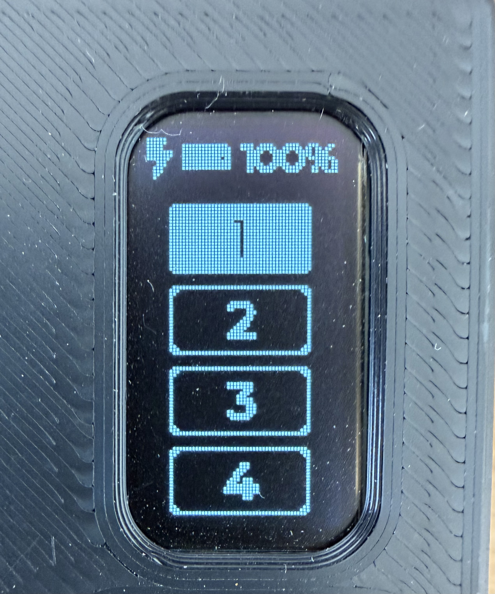

**tl;dr:** Built out the real OLED screen — battery and a row of profile boxes with the active one inverted. Three
things: The bigger screen blew past the 4096 LVGL pool too, so I bumped it to 8192; with no `inversion-on` in 
the device tree the panel runs `MONO01`, where `lv_color_white()` is an *off* pixel, so my colours came out as
a photographic negative until I swapped them and let the mono theme drive; and LVGL's `set_rotation` is a no-op
on this stack because Zephyr's mono flush writes coordinates untransformed, so I wrote a custom flush callback
that rotates the 1-bit buffer myself. Landed upside down first, flipped it, done.

**Time spent this session: 7 hours**


#### May 31: Fixed bugs from my custom screen (font)

*Milestone 4 · Claude Code session: "Milestone 4: Cosmetic screen"*

The screen was basically done, so this session was pure cosmetics: making the little OLED status screen actually
look good. Three things bugged me:

1. The battery icon looked way too bulky — the outlines were fat.
2. The percentage font was bulky too, sat about 2 px too high, and had weird stray pixels floating *outside* the
   glyph outlines.
3. The whole battery row was jammed into the top-right corner instead of being centred.

My first instinct was that this was a black/white inversion problem again. The panel is 1-bit and I'd already been
burned by which colour means "lit", so the working theory was that the font was being drawn in the wrong polarity.

That theory died fast. If the polarity were actually flipped, the *entire* screen would invert — a fully lit
background with dark text, and I'd notice that immediately. The profile boxes rendered fine. Only the battery text
and icon looked bad. So it wasn't the colours.

Claude and I went digging into how the text actually gets rendered, and the real culprit turned out to be
anti-aliasing:

1. The font I was using (Montserrat) is a **4-bit-per-pixel** font — 16 levels of anti-aliasing, smooth grey
   edges, designed for a proper grayscale display.
2. The battery and charge icons aren't a separate icon set — they're FontAwesome glyphs *baked into that same
   Montserrat font*. So they're 4bpp and anti-aliased too. There is no crisper battery symbol hiding anywhere;
   they all come from the one fuzzy font.
3. My panel is 1-bit. Every pixel is on or off, no in-between. So when the graphics library draws a 4bpp glyph
   onto a 1-bit surface, it renders the glyph as a grey mask and then **thresholds each pixel's brightness at
   127**.

And there's the whole problem. All those soft anti-aliased edge pixels sit *right around* that 127 threshold, so
whether an edge pixel lights up or not is basically a coin flip — which is exactly what "bulky outlines" and
"stray pixels outside the glyph" are. On top of that, Montserrat 12 has a 15 px line height, which is why the text
read as too tall.


On the 100% reading in that picture the edge bleeding doesn't look as awful as it does on the other percentages,
but you can still see how much bolder and thicker the font is compared to the next picture.

Once I understood *that*, the fix wrote itself: stop feeding an anti-aliased font to a display that can't
anti-alias.

- The percentage now uses UNSCII 8, a true **1bpp** bitmap font — no grey edges to threshold, so every glyph is
  pixel-exact. Bonus, it's 8 px instead of 15, so it stops sitting too high.
- The battery icon I stopped drawing as a glyph entirely. It's now built from plain full-opacity rectangles — an
  outlined body, a little terminal nub, and a fill bar whose width tracks the actual charge level. Axis-aligned
  opaque rectangles never get anti-aliased, so they stay crisp no matter what.
- The charging bolt I hand-drew pixel by pixel into a tiny 1bpp canvas.
- And the row position is recomputed on every update so the whole thing stays centred.

That first pass already looked miles better. Then I looked at it properly and started nitpicking, which turned
into a second round of changes.

**Charging.** I decided that when it's plugged in, the battery should fill up solid and show a dark lightning bolt
cut *out* of the fill — like the bolt is punched through it — spanning nearly the full height. So I redrew the
bolt bigger and inverted the idea: the canvas background is lit and the bolt itself is the OFF pixels.

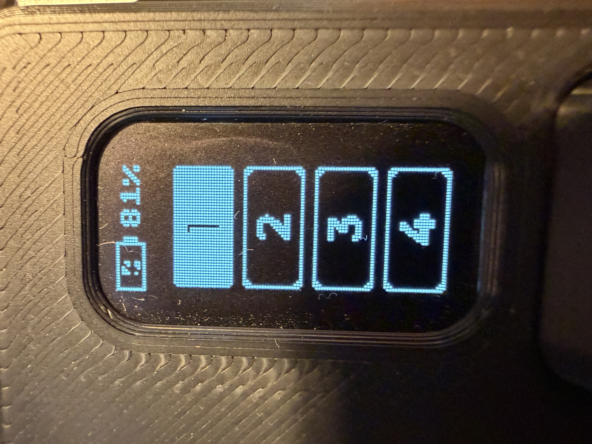

Except that's not quite what's in the picture — the battery icon isn't filled there, it's the bolt bitmap overlaid
on top of it. It looks weird, and I left it that way, because for this session I only wanted to prove I *can* draw
it on the right event. Getting the cut-out actually right is an M6 problem.

**The profile boxes.** Too narrow and floating with mismatched margins. I widened them, moved the whole column up
so it starts right under the battery, and lined the numbers up so the gap on the sides equals the gap at the
bottom. Then I rounded the corners more, because I thought they'd match the enclosure's round-offs better.

**The selected digit.** This is the part I liked. The numbers looked great when a box was *un*selected — nice and
bold. But the moment a box became the active one (which inverts it: dark digit on a lit fill), the digit's stems
shrank to about 1 px wide. Selected and unselected didn't match, and it looked cheap.

And it was the *same bug from the start of the session*. The digits were still an anti-aliased 4bpp font, and the
127 threshold doesn't treat the two polarities symmetrically — the edge pixels that survive one way get eaten the
other way. Same villain, second appearance, same fix: swap the digits to UNSCII 16, a 1bpp font, pixel-identical
no matter which way you invert it.

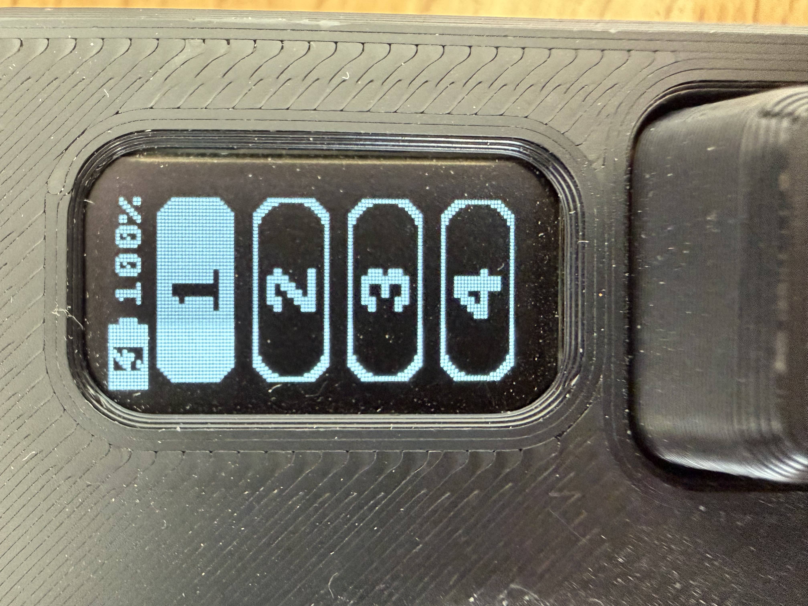

Both variants built clean and I flashed it to the actual hardware to check.

One thing still open at the end: the battery cut-out. Right now the battery icon is filled white with the bolt
bitmap sitting on it as a black square with a white bolt inside, which is not the punched-through look I wanted.
That one carries into M6, when I kind of wrap up the firmware.

**tl;dr:** The battery readout looked fuzzy and bulky and I assumed a black/white polarity bug. It wasn't — it was
anti-aliasing. The 4bpp Montserrat font (and the FontAwesome battery icons baked into it) gets
luminance-thresholded at 127 onto the 1-bit panel, so every soft edge pixel becomes a coin flip. The fix was to
stop using anti-aliased fonts here: 1bpp UNSCII for the text and digits, and a battery icon built from plain
rectangles plus a hand-drawn bolt. The same threshold asymmetry also explained why the *selected* profile digit
rendered ~1 px thinner than the unselected ones. Battery cut-out still isn't right — carrying that into M6.

**Time spent this session: 7 hours**


#### June 7: Starting to implement the encoder

*Milestone 5 · Claude Code session: "Milestone 5: Encoder"*

[](assets/journal-assets/2026-06-07-Knob-Location.jpeg)!

This was the session where the implementation of the encoder was finally started. 
On the board of my macro keyboard I placed an AS5600 magnetic encoder. This is a little chip that reads the 
angle of a magnet, that is attached to the knob, and reports it over I2C. The goal was to turn the knob and have
it perform *different actions per profile*, that the keypad is in (volume on one, scroll on another, and so on).

First surprise: ZMK has no driver for the AS5600. There's an encoder driver in ZMK, but it's for the classic
mechanical EC11 quadrature encoders (the ones with two square-wave pins). The AS5600 is a totally different
animal — an absolute angle sensor you talk to over I2C. So the driver had to be written from scratch.

**A short explainer, because the rest of this entry depends on it: how ZMK actually consumes an encoder.**

ZMK doesn't think in terms of "encoder." It thinks in terms of a Zephyr *sensor* — the same abstraction Zephyr
uses for thermometers and accelerometers — that happens to report rotation. The chain has four links:

1. **The driver** decides when there's new data and raises a `data ready` trigger.
2. **ZMK's keymap-sensor subsystem** catches that trigger and asks the sensor for one value: rotation on the
   `SENSOR_CHAN_ROTATION` channel, expressed in **degrees** (a whole part and a millionths part).
3. It converts those degrees into **ticks** using a `triggers-per-rotation` number — "how many times should the
   knob fire per full 360° turn." That's the knob-feel dial: 14 per rotation means one action every ~26° of
   turn, 120 per rotation means one every 3°.
4. Each tick runs whatever **sensor behavior** the keymap bound to that knob, on that layer.

That last link matters for how the whole thing ended up structured: the binding is per layer, and since a profile
*is* a layer on this keyboard, every profile can bind the knob to something different.

The EC11 driver fires the trigger in step 1 off GPIO interrupts. But on this board the AS5600's one spare output
pin isn't even wired to the MCU, so there's nothing to interrupt on — the only way to know the knob moved is to
keep *asking*. So my driver polls.

**Writing it.** I hadn't written a Zephyr sensor driver before, so the way Claude and I worked it was:
read first, then write. We pulled up Zephyr's sensor driver API and ZMK's own EC11 driver side by side and used
them as the shape to copy — what a driver has to register, which API functions are mandatory (`sample_fetch`,
`channel_get`, `trigger_set`), and how the devicetree instance macros stamp one driver instance out per node.
Then I described what mine had to do differently (poll instead of interrupt, absolute angle instead of
quadrature) and we built it up (piece by piece).

What it does, concretely: read the 12-bit RAW ANGLE register (0x0E/0x0F) over I2C. The AS5600 divides a full
revolution into **4096 counts**, so one count is about 0.088° and one whole degree is roughly 12 counts. Take the
difference from the last reading, handle the wrap when the magnet crosses the 4095→0 boundary, and accumulate.
Once at least one whole degree has piled up, report it and carry the remainder forward. All of that runs on its
own dedicated thread at a 5 ms poll — deliberately kept off ZMK's system work queue, because that queue also runs
the Bluetooth and USB sending, and a blocked I2C read there would take the whole radio down with it.

**Wiring it into the firmware.** The driver doesn't live in ZMK's tree — it sits in my own out-of-tree module
alongside my custom behaviors and status screen, which gets pulled into the build as an extra Zephyr module. From
there the hookup is all devicetree: the chip gets a node on the I2C bus at address 0x36 with my own compatible
string, a `zmk,keymap-sensors` node points at it to tell ZMK "this is the keymap's sensor," and then each layer
in the keymap gets a `sensor-bindings` entry naming the behavior that should run on a tick. Kconfig turns the
driver on when the devicetree node is present, and the tunables (poll period, smoothing, deadband, startup delay)
are Kconfig options so I can change the feel without touching the code.

A few Zephyr/ZMK potholes on the way:

1. **The compatible-string collision.** Zephyr actually *does* ship a bare AS5600 driver, just not one ZMK can
   use. If I named my devicetree node with the same `ams,as5600` string, both drivers would try to claim the chip
   and the build would fight itself. So mine is `nikolas,as5600` — my own name, my own driver.
2. **A Kconfig dependency explosion.** My first attempt had the driver `select` the sensor subsystem while also
   depending on I2C, and Kconfig spat out a giant recursive-dependency wall of text. The fix was to nest it under
   an `if SENSOR` block the way the stock drivers do, instead of forcing it on.
3. **A macro that no longer exists.** The obvious way to embed a thread's stack in a struct
   (`K_THREAD_STACK_MEMBER`) was quietly removed in this Zephyr version; it's `K_KERNEL_STACK_MEMBER` now.

And then the genuinely sneaky one, which Claude caught reading through ZMK's rotation handling: there's a
backwards-compatibility trap where a report of "zero whole degrees" makes ZMK reinterpret the *fractional* field
as a raw count of clicks. So if my driver ever reported a tiny sub-degree nudge, ZMK would read that as something
like 175,000 clicks and go berserk. The fix is to make the driver hold its motion until at least a whole degree
has built up before reporting, carrying the leftover forward so nothing is lost.

With all that, **volume worked.** Turn the knob, volume goes up and down. Great.

**Scroll was a bigger rabbit hole.** ZMK has a mouse-scroll behavior, so I wired the knob to it — and turning the
knob did *absolutely nothing*. Turns out that behavior is a *velocity* model built for holding down a mouse key:
When you press and hold a pointing key, ZMK starts a timer and applies an internal velocity curve. Instead of sending
the same delta value repeatedly, ZMK dynamically calculates the exact speed at that specific millisecond, generates 
the appropriate delta for that speed, and injects it into the standard HID report. To the host operating system, it 
looks exactly like a standard USB or Bluetooth mouse being physically pushed faster and faster.
An encoder tick is an instantaneous nudge, not a hold, so the math worked out to roughly zero movement per tick. 
Wrong tool. I ended up bypassing it entirely and reporting discrete scroll-wheel notches straight into the input 
system — one clean notch per tick, exactly like a real scroll wheel clicks.

**Per-profile modes** had their own twist. My plan was to pick the knob's job per profile inside ZMK Studio.
Except Studio, in this version, literally can't touch encoders — its editing protocol only understands key
positions, not knobs. So there's no version of "configure the encoder in Studio", and the whole thing had to live
in firmware instead: each profile remembers its own mode, a little dispatcher reads that mode at every tick and
does the right thing, and a dedicated key cycles the current profile's mode.

Last thing: the scroll *feel*. Turning slowly felt precise, but turning fast made the page suddenly rocket. And
that is not good and surprisingly not my firmware at all; it's macOS's built-in scroll acceleration, which it
applies to every scroll wheel on earth.
MacOS has notoriously aggressive, non-linear acceleration curves built into its standard HID scroll wheel drivers:
- Low frequency reports: If you send scroll ticks slowly, macOS scrolls the page a painfully small amount.
- High frequency reports: If you send them rapidly, macOS accelerates the scroll exponentially, violently launching
  you to the bottom of the page.
My firmware sends a perfectly linear stream of ticks. I killed the scrolling speed up of macOS host-side with a
free app (LinearMouse), watched it go apply a linear acceleration, and called it solved. 
(It was not solved. That "fix" created a different problem which was hard to understand for another five days.)

Resolution: I divided the resolution per mode by giving multiple `triggers-per-rotation` dials from the explainer
above to each mode (every mode has it's own). Volume stays coarse at 14 ticks per full turn (one volume step every
~26°, so a small twist is one step), tabs coarser still at 12, and scroll is fine at 120 per turn (one every 3°) so
it actually uses the encoder's precision.

[Demo Video of scrolling with default macOS acceleration](assets/journal-assets/2026-06-07-Demo-Volume+macOS-acc-in-vscroll.mov)!

The video still has macOS acceleration doing its thing in the scroll section — this is from before LinearMouse.

**tl;dr:** Wrote an AS5600 sensor driver from scratch because ZMK doesn't have one, polling the chip over I2C on
its own thread since there's no interrupt line. Dodged a compatible-string clash, a Kconfig recursion, a removed
macro, and a "zero degrees means raw click count" trap. Volume was easy; scroll needed me to ditch ZMK's
velocity-based mouse behavior and emit real discrete wheel notches; per-profile modes had to be firmware because
Studio can't edit encoders at all. And I thought I'd solved the scroll feel with LinearMouse. I had not.

**Time spent this session: 11.5 hours**


#### June 8: The hang that was really the encoder never shutting up

*Milestone 5 · Claude Code session: "Milestone 5: Encoder"*

This is a debugging story with a clean twist at the end, so bear with me.

After the encoder was working, I noticed the keypad would sometimes just freeze. Non-responsive and it needed a
power cycle. Not constantly, but it occurred with a 30% chance over a five-minute run. And weirdly, it only
ever happened over **USB**; on Bluetooth it never froze once.

The first batch of fixes were mostly looking at the startup, that could cause this problem:

- Make the encoder's poll thread wait a second before its very first I2C read, so it isn't hammering the shared
  I2C bus while the OLED is still running its own boot sequence on that same bus.
- Seed the starting angle from inside the thread, so it can't fire one enormous bogus "you turned the knob 300°"
  event at power-on.
- Double the poll thread's stack, since that thread is where a whole chain of ZMK work runs.

Those helped — the boot-time freezes stopped. I also caught a self-inflicted wound: at one point I'd tried firing
one USB report *per scroll tick* to fight the acceleration, and a fast spin absolutely flooded the USB sending
path and hung it. Reverted that to one report per event.

But the freezes *during use* didn't go away, and I was still guessing. Then came the clue that cracked it, and it
came from a completely different direction: ever since the encoder work, **the screen had stopped turning off by
itself.** Normally the display blanks after you leave the keypad alone for a bit. Now it never did.

The screen blanks when the keypad decides it's idle. If it never blanks, the keypad thinks it's *never* idle, which
means something is constantly telling it the user is doing things. I put that to Claude:

1. The poll thread just waking up every few milliseconds — but simply running shouldn't register as user activity.
2. Some stray mouse/input event stream leaking out.
3. The encoder itself raising a constant drizzle of "the knob moved!" events, even though nobody's touching it.

It was #3, and it's kind of beautiful once you see it. ZMK's activity tracker — the thing that decides idle vs
active — treats *every sensor event as user activity* and resets its idle timer. And the AS5600, like any real
sensor, has noise: the raw angle it reports jitters by a count or two even when the magnet is bolted in place and
dead still. My driver reports motion once about a degree has piled up… and that one-or-two-count jitter
random-walks its way past a degree roughly **once a second**, forever. So the encoder was raising a phantom "it
moved" event every second of every minute. The idle timer never got a chance to expire — hence the screen never
sleeping. And that same relentless churn, running the full sensor→behavior→USB chain over and over for eternity,
is what was eventually wedging the USB path and freezing the board.

Two symptoms — "won't sleep" and "randomly hangs on USB" — one single cause: **the encoder never stopped talking.**

The fix is a *deadband*: pick a reference angle, ignore any wiggle smaller than a few counts around it, and only
move the reference when the knob *actually* turns. A resting magnet now produces exactly zero events. Flashed it,
and both problems vanished together — the screen blanks on idle again, and the hangs are gone. I later added a
light smoothing filter on the raw angle too, so the deadband can stay nice and tight without noise creeping back
in.

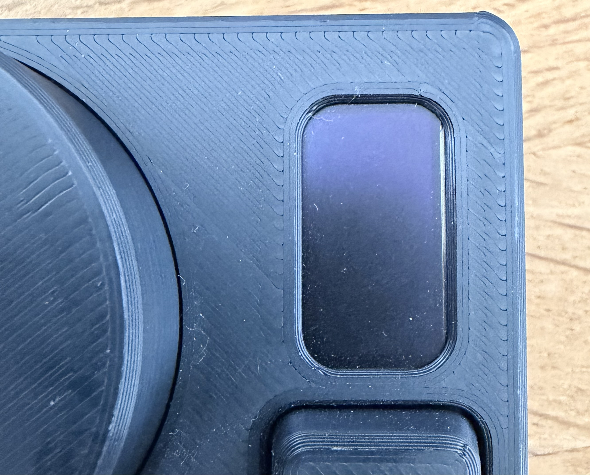

The lesson I'm taking from this: two bugs that look unrelated are worth staring at together, because sometimes
"the display won't sleep" and "the thing crashes" are the exact same problem wearing two hats.

**tl;dr:** The keypad kept freezing (only on USB, ~30% over five minutes) and, separately, the screen had stopped
ever turning off. Same root cause: ZMK counts every sensor event as user activity, and the AS5600's still-magnet
noise random-walked past my one-degree report threshold about once a second, so the encoder was raising phantom
"it moved" events forever — which blocked idle/sleep *and* slowly wedged USB. A deadband killed the phantom events
and fixed both at once.

**Time spent this session: 4.5 hours**


#### June 12: Chasing smooth scrolling (and losing to macOS)

*Milestone 5 · Claude Code session: "Milestone 5: Adding high res scroll + tab mode"*

Quick recap of where the encoder was: the AS5600 knob works, and one of its modes is scrolling. The problem was
the *feel*. I run my mouse with acceleration turned off (LinearMouse — see the last entry), and the encoder fires
a lot of scroll triggers per rotation, so scrolling ended up painfully slow: every trigger nudged the page a tiny
fixed amount and there was no acceleration to make a fast spin actually fast. So the plan sounded simple — speed
the scrolling up and add acceleration, on the firmware side.

That turned out to be optimistic.

[Demo Video of scrolling with default macOS acceleration](assets/journal-assets/2026-06-07-Demo-Volume+macOS-acc-in-vscroll.mov)!

(How it was before.) That's the only "before" video I'm putting in, and there'll be exactly one "after" at the
end, because scroll feel is genuinely hard to show on video — you can't really *see* smoothness, you have to have
your hand on the knob. Anything in between would just be more footage of a page moving.

**Explainer first, because none of the rest of this entry makes sense without it: what actually happens between
turning the knob and the page moving.** There are more layers here than I expected going in, and the whole
session is really a story about finding out which one is in charge.

Starting at the knob and walking outward:

1. **Magnet → counts.** The AS5600 splits a full revolution into 4096 counts (~0.088° each). My driver polls that
   every 5 ms and accumulates the difference.
2. **Counts → degrees.** Once a whole degree has built up, the driver reports it to ZMK as rotation in degrees,
   carrying the remainder.
3. **Degrees → ticks.** ZMK converts degrees into ticks via `triggers-per-rotation`. For scroll I set 120 per
   revolution, so one tick every 3° of turn. **This number is the base scroll speed**: more ticks per rotation =
   more scrolling per rotation.
4. **Ticks → line-deltas.** Each tick becomes a wheel movement of `scroll-units` "lines" (I keep this at 1). This
   is the *magnitude* — the actual number that goes in the report.
5. **Line-deltas → HID reports.** ZMK's pointing subsystem packs that into a standard HID mouse report — the same
   wheel field a normal mouse uses — and ships it over USB or BLE.
   The HID report only preserves a Signed 8-bit Integer for the vertical scroll - so just scroll units, that where
   performed in between of HID reports/last report. That the datatype is an int, will be a problem for me - although
   it makes sense that it is for the rest of the mouse HIDs...
6. **HID reports → scrolling pixels.** The host reads the wheel value and decides how far the page actually moves.

**High-resolution scrolling** is worth its own paragraph, since I spent hours on it. A traditional mouse wheel is
notched, and classically one unit in the report will be interpreted into one line of scrolling on the host. That's
chunky: you can't express half a notch (because the HID report carries an int). The HID fix is the **Resolution 
Multiplier**: the device tells the host "my wheel sends 16 units per notch," so the host divides by 16 and can scroll
in fractions of a line, which is what makes modern trackpad-style scrolling smooth. ZMK exposes this as smooth 
scrolling and advertises a multiplier of 16. That sounds perfect for an encoder with 120 ticks per rotation — except
 a multiplier only does anything if the host honours it.

So by the time the movement reaches the screen, three separate things *could* be scaling it: the **resolution
multiplier** (step 5→6), the **report rate** (how many reports per second arrive), and the **magnitude** (the
number inside each report). My whole plan — "add acceleration in firmware" — assumed magnitude was in charge and
that firmware could shape it. Working out which of the three macOS actually cares about *is* the session.

With that, the debugging.

The first thing I tried was the obvious one: raise the base speed and add a velocity-based acceleration curve in
the firmware — measure how fast the knob is turning from the time between ticks, and multiply the scroll amount up
when it's spinning fast. Built it, flashed it. The acceleration part felt kind of nice, but two things were off:
the ceiling where it stopped accelerating was way too low, and — more confusingly — changing the base "scroll
units" knob did *nothing at all*. I could set it to 1 or to 32 and the scrolling looked identical.

The real question was: what does macOS actually *do* with the number I put in the scroll report? Claude and I 
read up on how ZMK's smooth scrolling works and how macOS interprets it, and then just ran experiments.

1. **Maybe high-res scrolling is dividing my value by 16.** ZMK's smooth scrolling advertises a HID "Resolution
   Multiplier" of 16, which on paper means the host treats 16 units as one notch. So I built two firmwares — one
   with smooth scrolling on, one off — identical except for that single flag. If macOS honoured the multiplier,
   the no-smooth build should have been ~16× faster. Result: *identical*. macOS just ignores the multiplier for
   my device.
2. **Maybe I'm not sending enough reports per second.** New idea: faster scrolling = more discrete steps. So I
   rewrote it to fire many more little steps, paced so they wouldn't flood the link. Tested over Bluetooth: no
   change. Then I made a build that massively over-produced steps (ten per tick) and compared Bluetooth against a
   USB cable — USB can push ~1000 reports/s, Bluetooth is capped around 66–133/s by the connection interval. If
   report *rate* mattered, USB should have blown Bluetooth away. Result: *exactly the same on both*. So macOS
   velocity-caps scrolling — past some low rate, more reports do nothing.
3. **So it has to be the magnitude — but which host layer eats it?** Turns out the value gets ignored
   *specifically because of LinearMouse*. LinearMouse's whole job is to remove acceleration, and the only way it
   can do that cleanly is to normalise every scroll event to a fixed distance — which throws my magnitude away.
   So my June 7 "fix" was the very thing blocking me now. When I turned LinearMouse off and let macOS handle the
   raw reports, magnitude suddenly mattered a lot… except now macOS applied its *own* acceleration, which is a
   nasty sudden "jump" at a very low speed threshold, and everything was way too fast.

So, to close the explainer from the top of the entry — **of the three things that could scale my scrolling, macOS
uses exactly one.** It throws away the resolution multiplier, it velocity-caps the report rate, and the only
input it genuinely consumes is the per-report magnitude. Then it runs that magnitude through *its own*
acceleration curve: macOS looks at how fast the scroll events are arriving and multiplies the distance up 
accordingly. On a trackpad that curve should feel natural. Fed by an encoder and it does not — it's flat and too
slow for a while, then crosses a threshold at a very low speed and *jumps*, and past that it saturates. That's
the behavior from the first video.


And that's why the firmware can't win. Acceleration in firmware means multiplying the magnitude — but macOS then
accelerates my already-accelerated magnitude, so I'd be stacking one curve on top of another curve I can't see or
disable. The only way to get a predictable result is to give macOS a boring linear stream and let one thing own
the curve.

So basically: **on macOS, the scroll feel belongs to the host, not the firmware.** My two native options were both
bad — LinearMouse (linear, but a fixed un-tunable step) or macOS default (a jumpy, uncontrollable accel curve). 
Neither gives you "smooth scrolling".

So the solution was being less delusional with the implementation of a HID, that doesn't use any extra companion
app... So there's a whole category of macOS apps built for exactly this: pixel-based smooth scrolling with a tunable
acceleration curve, without normalising every scroll unit.
I tried **Mac Mouse Fix** (Mos is the free alternative) and it worked right away. It offered smooth scrolling and also
inertia, which I wanted to implement into the firmware (but I don't need to anymore), and you could configure those
parameters very well. Bonus, it also fixed the separate problem where VS Code scrolls way to fast, because the too many
arriving scroll events get each one whole line. Another big advantage is that I can use the macOS scroll speed (can
also be configured with Mac Mouse Fix) and never need to open the app again, if I want to adjust the scroll speed.

In short:
That flipped the firmware's job. It is now very simple: a clean, linear stream of one line per tick, zero acceleration.
The app owns smoothing, acceleration, and even the little bit of scroll inertia I'd originally planned to add in firmware.

[Demo Video of scrolling with Mac Mouse Fix](assets/journal-assets/2026-06-12-Demo-Scroll-w-Mac-Mouse-Fix.mov)!

While I was in there I added an encoder mode I'd wanted for a while: scrolling through browser tabs. Clockwise =
next tab, counter-clockwise = previous, mapped to Ctrl+Tab / Ctrl+Shift+Tab (works across browsers on macOS).
It's coarse on purpose — about one tab per notch — so a small twist moves exactly one tab instead of flinging you
ten tabs over. The browser profile defaults to it now. That one just worked, first try.

And then, right when it all felt finished, the old USB hang came back — the board freezing during heavy scrolling
over USB. I was pretty sure it was the same family as the earlier flood-the-HID-TX bug, and it was, but the
mechanism was sneakier than I remembered:

1. **Is it just too many reports flooding USB?** Kind of, but not on paper — the USB endpoint polls every 1 ms and
   the send semaphore is capped, so a plain "too many reports" story didn't quite close.
2. **Where does the scroll report actually get sent from?** This was the key. ZMK runs the whole
   sensor→behavior→HID chain *synchronously on the AS5600's own poll thread*, and every USB HID send blocks on a
   30 ms semaphore. A fast spin fires the sensor ~200 times a second, and sending one HID report per tick,
   sustained, keeps that path pinned — one macOS polling hiccup becomes a 30 ms stall and the HID TX wedges. The
   reason it only resurfaced *now* is almost funny: the scrolling finally feels good, so I actually scroll
   continuously for long stretches, which I never did back when it was janky.

The fix is the same shape as the original, just more disciplined: the firmware still tracks every degree of
rotation, but it *coalesces* the scroll into at most one report every 12 ms (~83/s, comfortably under the
Bluetooth rate that never has this problem) and carries the leftover so nothing is lost. macOS caps the rate
anyway and Mac Mouse Fix smooths between reports, so you can't feel the difference — except it doesn't hang.
Tested by scrolling as hard and as long as I could over USB. Rock solid.

**tl;dr:** Spent the session trying to make encoder scrolling fast *and* smooth in firmware, and slowly proved
that on macOS the host owns the scroll feel: it ignores HID high-res, caps the report *rate* so more reports don't
help, and either normalises the magnitude away (LinearMouse) or applies its own bad acceleration (default OS). The
right answer was a smooth-scroll app (Mac Mouse Fix) plus firmware sending a clean line-per-tick stream with
zero acceleration. Also added a browser-tab encoder mode, and fixed a USB hang caused by firing one HID report per
tick during sustained scrolling — now down to ≤83/s.

**Time spent this session: 12 hours**


#### June 26: Studio profiles, fixed encoder modes, and a screen rework

*Milestone 6 · Claude Code session: "Milestone 6 + bug fixes"*

This was the "clear out the M6 backlog" session. A bunch of things I'd deferred while getting the encoder and the
screen working — all small on their own, but they'd been nagging at me.

**Adding and deleting profiles in ZMK Studio.** I wanted to be able to add or remove profiles from Studio instead
of hardcoding them in the keymap. It turns out ZMK's mechanism for this is "reserved" layers: you declare extra
layer slots with `status = "reserved"`, and they sit there inactive until Studio's "add layer" button fills one
in. So I ship 5 real profiles plus 2 reserved spares, which caps me at 7 — which happens to be exactly how many
profile cells fit on the OLED anyway, so that lined up nicely. Pleasant surprise along the way: just turning on
ZMK Studio already pulls in layer reordering *and* NVS keymap storage, so add/remove/rename all persist to flash
for free.

**Encoder modes that survive a reboot.** Each profile remembers its own encoder mode, but until now that lived
only in RAM, so a power cycle reset everything to defaults. I wired it up to save into NVS. The first pass used
ZMK's normal 60-second save debounce, but that felt wrong here — if I change a mode and immediately flip the power
switch, I want it to have stuck. So it saves immediately instead.

**The Studio active-layer thing that isn't a bug.** I'd been bothered that ZMK Studio doesn't highlight which
profile is currently live on the keyboard. Claude and I went digging through the Studio RPC protocol and the docs
expecting to find a setting I'd missed — and there just isn't one. The protocol has no "active layer changed"
message in this version of ZMK; it's simply not a feature. Not something wrong on my end. And the OLED already
shows the active profile anyway, so it doesn't matter.

**A small power fix.** The magnetic encoder has no interrupt line, so its driver polls the angle over I2C on its
own thread every 5 ms, forever. That's ~200 CPU wake-ups a second even when nothing's happening, which stops the
chip from ever settling into low-power idle. The poll thread now backs off to every 100 ms once the board goes
idle, and goes back to fast polling the moment you touch the knob again.

**The screen rebuild.** This was the biggest chunk of the session. The M4 screen showed the battery and a column
of numbered profile boxes and that was it — no indication of which encoder mode was live, or whether I was on USB
or Bluetooth, and the profiles were just digits. So I rebuilt the layout: battery row stays on top, then two split
status lines — `CT:` for connection type (USB/BLE) and `EM:` for encoder mode (VOL/VSCR/HSCR/TABS), prefix on the
left edge and value on the right — and then the profile column underneath. The active profile is now a full-height
rounded cell with the profile's actual *name* inverted inside it instead of a number, and the inactive ones are
squeezed filled bars whose height scales to however many profiles are actually live.

Two more problems with its solutions:

1. LVGL's own rounded corners are bevels at this size on a 1-bit panel, so I let Claude hand-draw every cell into
   a 1bpp canvas with my own symmetric rounded-rect rasteriser.
2. The obvious per-pixel canvas calls each trigger their own invalidate, and doing that per pixel made switching
   profiles visibly lag. Writing straight into the canvas bitmap and firing a single invalidate per update fixed
   it.

There's also a genuinely nasty gotcha in the canvas buffers: a 1-bit LVGL canvas has an 8-byte palette living
*inside* the buffer, which the addressing helper skips over but the buffer-size macro doesn't reserve space for.
So every canvas buffer needs those extra bytes added on top, and the bitmap base has to come from the helper
rather than the raw pointer. (This one comes back to bite me later.)

Then two layout bugs that took a couple of iterations to get right:

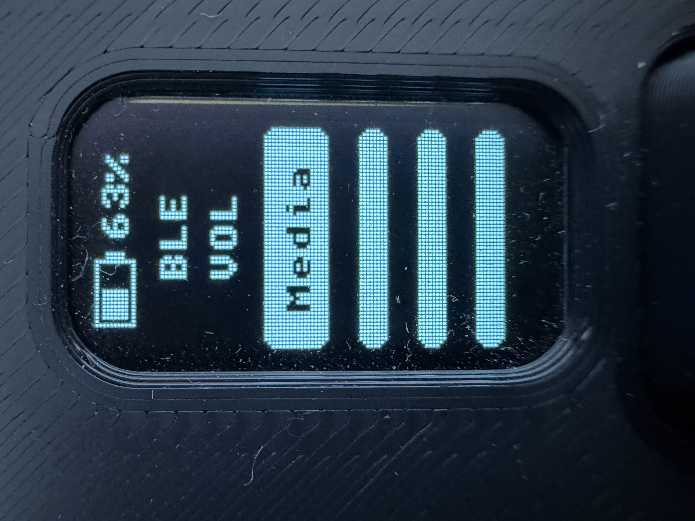

Round-off working, but inconsistent as soon as the profile count changed — I'd tied the corner radius to the cell
height, so at any count other than 5 the round-off went either too sharp or weirdly blobby.

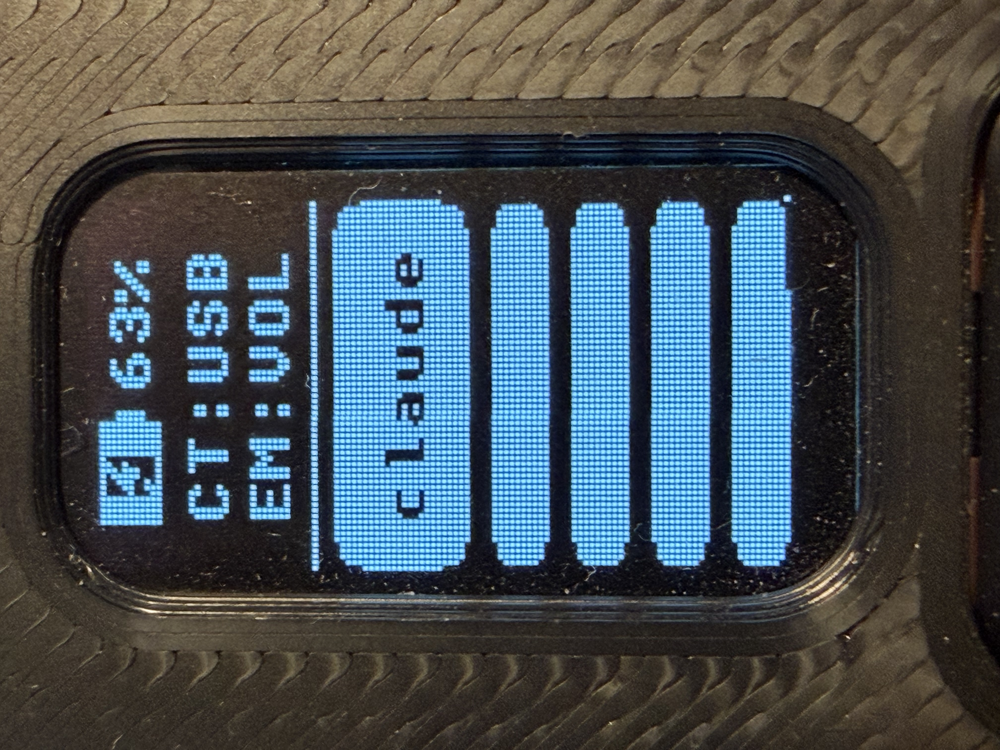

Better, but the radius still differed depending on whether a cell belonged to the selected profile or not. Fixed by
giving every cell one fixed radius, always. The other bug: with only 2 profiles the single inactive cell ballooned
to fill the entire column, because I was stretching everything down to the bottom edge. Now the inactive cells cap
at 10 px and just leave empty space below.

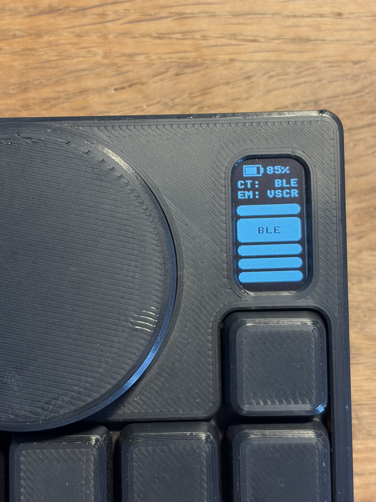

Final layout, consistent across every profile count.

**tl;dr:** Cleared the M6 backlog: Studio can now add and delete profiles via reserved layer slots (up to 7),
per-profile encoder modes persist to flash and save instantly, and the encoder poll backs off when idle to save
power. Also rebuilt the status screen — connection type and encoder mode get their own lines, the active profile
shows its name instead of a digit, and the cells are hand-drawn into a 1bpp canvas so the corners stay crisp — then
fixed two layout bugs so it looks right at any profile count. Also confirmed the "Studio doesn't show the active
layer" thing is a missing ZMK feature, not my bug.

**Time spent this session: 8 hours**


#### June 30: The USB crash that turned out to be a lightning bolt

*Milestone 6 · Claude Code session: "Milestone 6 + bug fixes"*

Great story though, so here's the whole thing.

**The report.** With the keyboard plugged into USB, it would go completely unresponsive after a few minutes —
screen frozen, keys dead, needs a power cycle. On Bluetooth it was rock solid for 15+ minutes. USB only. No
obvious trigger, it just... died.

The USB-vs-Bluetooth split was the biggest clue. What's actually different? On USB the board is always powered, so
it *never* deep-sleeps — every thread just keeps running forever. On battery it drops into deep sleep after a
while, which is basically a reset. So whatever was going wrong needed the board to stay awake and busy, and USB
kept it that way.

Claude's list of suspects:

1. A stack overflow somewhere, silently corrupting memory. The MPU (Memory Protection Unit) stack guard was turned 
   off, which means an overflow doesn't fault cleanly — it just quietly scribbles over whatever's next in RAM and the
   board falls over minutes later.
2. The encoder poll thread's stack (it runs the whole sensor→HID chain synchronously).
3. Some USB-side thread — the USB driver's work queue, or the main thread.
4. A deadlock on the shared I2C bus, since the OLED and the encoder are both on it.

First I turned on the MPU stack guard and added a fatal-error handler that reboots instead of hanging (Zephyr's
default is to just spin forever, which is exactly the dead-board behaviour). That immediately paid off as a
*diagnostic*: the board went from "hangs" to "reboots in a loop on USB." A reboot means the fatal handler is
firing, which means it's a genuine CPU fault, not a deadlock. Hypothesis 4, gone.

Then I started guessing at stacks, and this is the embarrassing part: three wrong guesses in a row.

- Bumped the encoder thread's stack. Nope. (That thread doesn't even start until a second after boot, and the
  fault was happening at boot — so it couldn't have been that. I should've caught that sooner.)
- Bumped the USB work-queue stack and the main stack. Nope.
- Found a genuine bug where the charge-bolt canvas buffer was 8 bytes too small — it wasn't reserving the palette
  space I'd just learned about. Real bug, worth fixing, but not the crash either.

At that point I was clearly poking in the dark, so we stopped guessing and built a proper diagnostic instead. No
debugger needed (thanks). The fatal handler stashes the faulting thread name, the reason code and the program counter
into a chunk of RAM that survives a reboot, and the boot-up screen prints it to the OLED. The neat part is that the
LiPo keeps that RAM alive even across a USB unplug, so the procedure is: plug in USB, let it crash-loop, unplug
USB, and the board boots on battery and shows me the last fault it hit. A tiny black-box recorder.

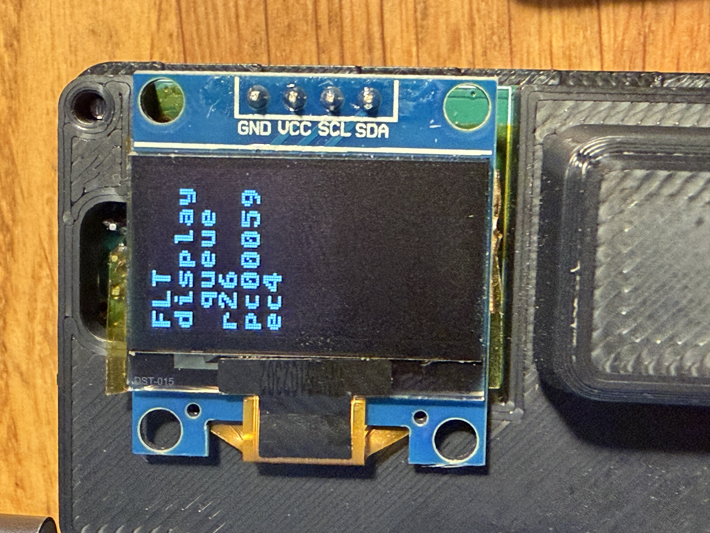

First capture: `FLT display queue r26 pc00059ec4`.

So the fault is in the *display* thread. Good — that narrows it down by a lot. But the reason code `26` made no sense
(Zephyr's standard fault reasons only go up to 4), and the program counter pointed at a Bluetooth function, which
a display thread would never call.

Turns out `26` was the actual answer, I just didn't recognise it. ARM adds its own architecture-specific fault
reasons starting at 16, and 26 decodes to an **imprecise bus fault** — a bad memory write that the CPU buffers and
reports *later*, on whatever instruction it happens to be on when the fault finally surfaces. That's exactly why
the program counter was pointing at unrelated Bluetooth code: for an imprecise fault.

There's a fix for that: you can disable the Cortex-M write buffer with a single bit in a config register, which
forces bus faults to be *precise* — reported on the exact instruction that did the bad write. So I flipped that
bit and captured again.

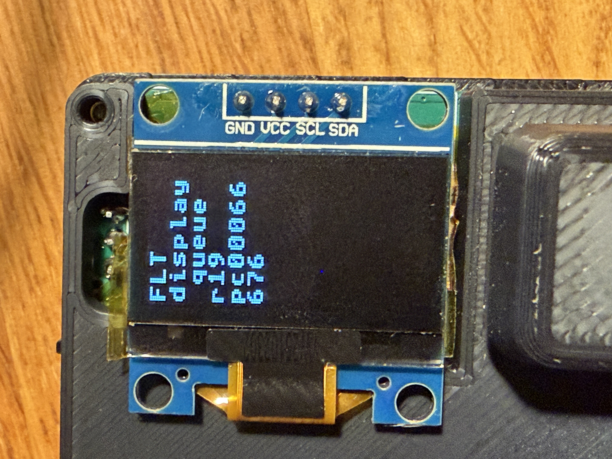

Second capture: `FLT display queue r19 pc00066676`.

Now `r19` is a clean MPU data-access violation, and the PC pointed straight at `argb8888_image_blend` — inside
LVGL's "blend an image to RGB565" routine. Yeah... my display is one bit per pixel, black and white. There is no
RGB565 anywhere. Why is LVGL doing 16-bit colour blending?

The only thing that draws *only* while charging (i.e. only on USB) is the little lightning-bolt icon in the battery.
I'd built that bolt as a canvas image sitting *inside* the bordered battery-body box, overlapping the battery fill. 
On a 1-bit display, when LVGL has to composite an image that's clipped inside a bordered container like that, it spins
up a temporary RGB565 layer to do the blend in — and the buffer math for that path is wrong for a 1-bit build. So it 
blended out of bounds and tripped the MPU. The profile-column canvas, which is the same kind of 1-bit canvas, *never*
crashed — because it's a standalone element sitting directly on the screen, not clipped inside anything and not 
overlapping anything.

So the fix was to make the charging graphic behave like the profile column: one standalone canvas, the size of the
battery interior, sitting directly on the screen, with the plain fill hidden while it's showing. Same lightning
bolt, drawn a safe way — which also finally closes out the battery cut-out I'd left looking wrong back in M4.

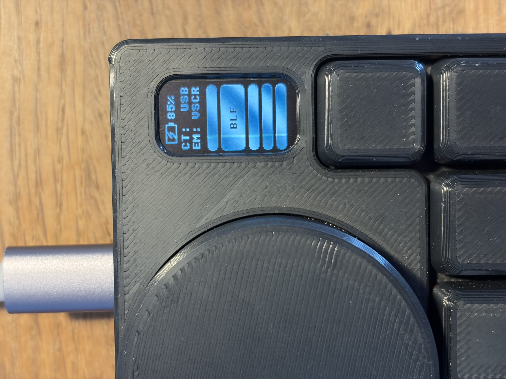

Then the cleanup pass: ripped out all the diagnostic scaffolding (the on-screen fault capture, the precise-fault
register hack, the thread naming) and reverted the three stack bumps that turned out to be red herrings. I kept
the two things genuinely worth keeping — the MPU stack guard and the reboot-on-fault handler — so if anything ever
does fault again, the board recovers on its own instead of hanging dead. Then I wrote the whole saga up in the
project notes, including the fault-capture trick, because I will 100% need it again someday.

Lessons I'm taking from this:
- On a 1-bit display, don't make a canvas or image a clipped child of a styled box, and don't let it overlap other
  things — keep decorative canvases standalone and directly on the screen.
- An imprecise bus fault has a useless PC. Force precise faults *first*, before you trust the program counter, or
  you'll chase ghosts. I chased three.
- When you catch yourself guessing at fixes, stop and build a way to actually *see* the fault. The OLED black-box
  recorder found in two captures what three blind guesses couldn't.

**tl;dr:** The keyboard kept dying on USB but not Bluetooth. After three wrong stack-size guesses I built an
on-screen fault capture (which survives a USB unplug thanks to the LiPo), forced the bus faults to be precise, and
traced it to LVGL blending the battery charge-bolt through a broken RGB565 layer — because the bolt was a canvas
image clipped inside the battery box. Rebuilt the charging graphic as a standalone screen-level canvas like the
profile column and it's stable, which also finally fixed the battery cut-out left over from M4. Kept the MPU stack
guard and reboot-on-fault as permanent safety nets.

**Time spent this session: 7 hours**


#### July 1: Fixed the LiPo not being charging

I got the LiPo battery of my macro keyboard to charge, so that's pretty neat.

Observation: When supplying the keypad with power, the charging indicator light up on the screen, but the
screen widget for the battery capacity would only show a static battery percentage.

What could cause this problem? Short answer:
1. Faulty screen indicator
2. Faulty resistors in the voltage divider
3. Charging IC not charging the LiPo: Could be due to something disabling the IC.

I was able to eliminate both cause #1 and #2 by measuring if the voltage of the battery increased when
supplying the charging IC. And it did not, this means the cap of the LiPo also stayed the same.
So it must be #3.

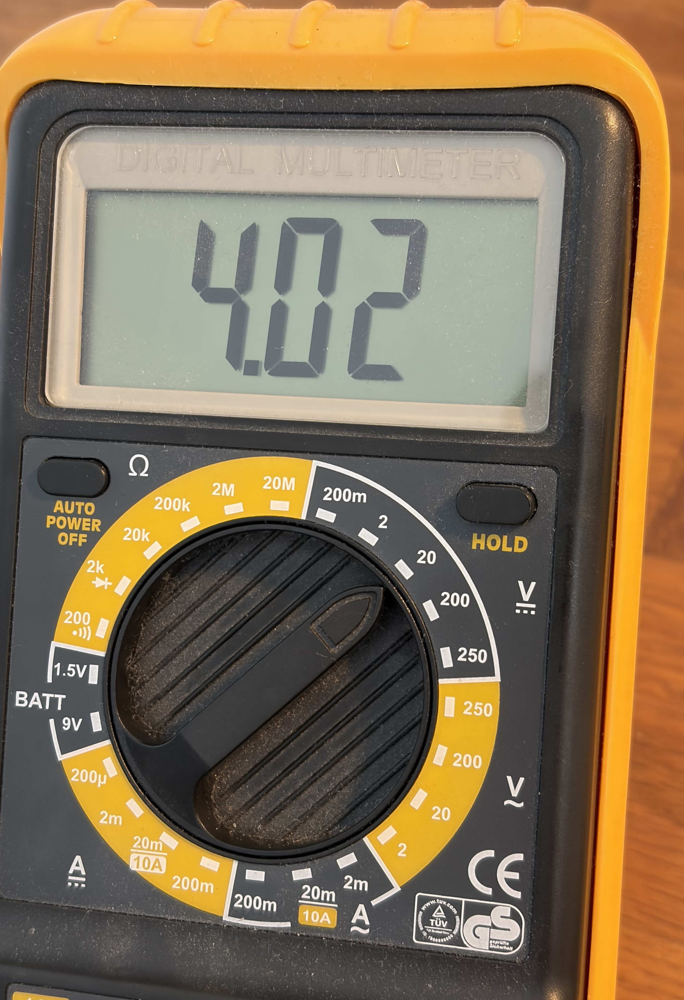

Because the ICs are usually fine, I looked into the schematic of the keyboard to see if I messed up something
there:

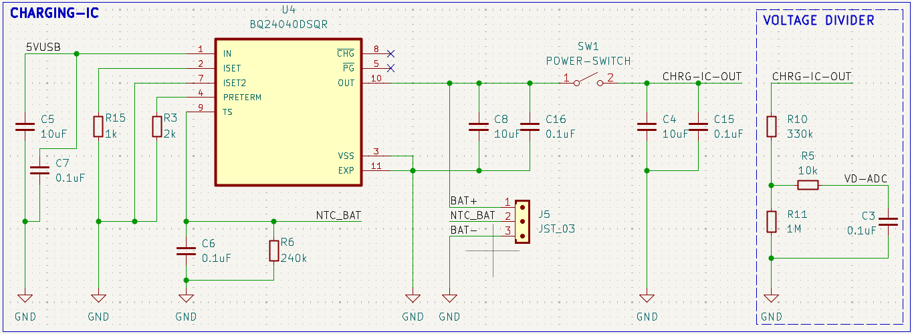

So I used the exact same IC before and it worked flawlessly. The only thing that I changed was that I made
use of the temperature sense terminal.
I looked into the datasheet of the IC and what could cause the charging IC to be disabled:

 

The TS (temperature-sense) is the BQ24040's veto over charging. When the NTCs resistance (changes
resistance with temperature of the bat pack) is not in the range that the BQ24040 likes, the battery is 
either to cold/absent or to hot. - Bc of safety, i wanted to implement it.
I measured TS-to-GND and got 237 kΩ. The key insight is from the datasheet is:
The IC pushes a fixed 50 µA through whatever's on TS and watches the *voltage*. At 50 µA a healthy 10 k NTC
sits around 0.5 V, dead center of the charge window. My 237 kΩ slams that node way
past the ~1.6 V "thermistor removed / freezing" threshold, so the IC decided
the battery was impossibly cold (or absent) and quietly disabled charging.

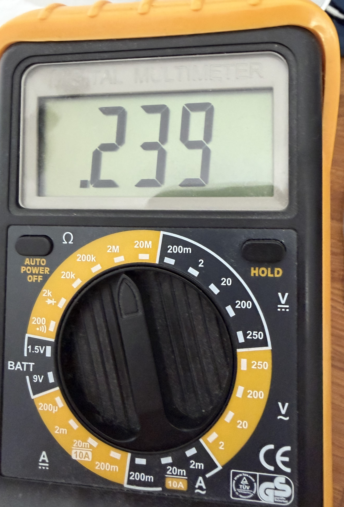

R6 is 240 k and it's supposed to sit in *parallel* with the pack's 10 k NTC → 10k ∥ 250k ≈ 9.6 kΩ.
If the NTC were actually in the circuit I could never measure *above* 10 k. Reading 237 k meant
the thermistor's return path was gone.

But why is the pack's NTC was never electrically present?
I asked Claude:
1. Either cold joints
2. BAT– isn't tied to the same GND R6 references → the NTC has no return path
3. The pack's third wire isn't a 10 k NTC.

And guess what? Yes, it was #3 again. I added the third wire (NTC) to the battery myself, because the battery
came without it. And I thought it was no problem as the BMS of the battery clearly labeled a third pad "NTC",
but it seems like the pad was just connected to no thermistor, because after measuring the resistance between
NTC and GND directly, there was none. Haha

Solution:
I don't need JEITA temp protection for the keypad to work (I will just get a LiPo with 3 wires the next time),
so I took the datasheet's sanctioned shortcut: a fixed 10 kΩ from TS to GND to pin the node back into the
normal window. In parallel with R6 that's ~9.6 kΩ → ~0.48 V on TS → charging
enabled.


Plugged in USB and the charge status finally went active — the pack is pulling
current for the first time.


**tl;dr:** LiPo wouldn't charge because the BQ24040's TS pin saw 237 kΩ (the
NTC was never in-circuit) and disabled charging. A 10 kΩ from TS to
GND put it back in range and enabled charging. For new keypads, I will just get the batteries with
3 wires.

**Time spent this session: 4 hours**


#### July 2: Wrote the BOM

I added and wrote BOMs (yes, plural) to fill some gaps in the repo and make the macro keyboard reproducible.

I noticed, that the shipping instructions for my project specifically ask for a bill of materials (BOM) to 
enable others to reproduce it. The current version doesn't have one, former ones had.

Why BOMs? - I landed on a multi-BOM structure (or idk how to call it):
- One BOM for PCBA under /hardware/PCB/KiCad/Macro-Keyboard-v4/production/bom.csv: After manufacturing the PCB, its populated with the components in this BOM. This step is the PCB assembly. Only the parts for this manufacturing steps are in this BOM. (e.g. nRf module, caps, resistors, usb port, etc.)
- PCB BOM under /hardware/BOM_PCB: Some of the parts, that need to be soldered onto the PCB, can't be soldered in the PCBA step, usually because those parts are to big. So I solder those manually. (e.g. key switches, OLED display, JST connector for LiPo - that's all)
The production BOM (for PCBA) captures only the parts for PCBA and the PCB BOM captures all of the parts, that need to be soldered onto the PCB, including the parts from PCBA.
- Master/build cost BOM: This BOM lists all of the on-PCB parts, which couldn't be populated with PCBA, + PCBA + the PCB itself (isn't included in neither PCB BOM or PCBA BOM) + all of the off-PCB parts. (e.g. enclosure + screws, the LiPo battery, bearings, keycaps, etc.)
This explains the structure. I will put this also in the README.md (probably in shorter form).

Only in the master/build cost BOM I added in the approximate costs for the components. I didn't also add 
prices to the PCB BOM, because PCBA cost might very, some components might need to be exchanged for other 
ones, tax and shipping costs can also change. Shipping cost, tax, customs duties are also listed as they 
are quite substantial.
In the end of the master BOM I calculated the approximate price per keyboard unit (without labour), which 
turned out to be about 61,38€. That could have been worse. But it needs to be said: If you somehow decide 
to build one on your own, you will end up paying more then just the price for one unit, because there are 
minimum ordere quantities for many components (above of what is needed for one keyboard unit). For example, 
the PCBs need to be ordered in quantity of 5 or above with JLCPCB.

To the main BOM I also added Notes to clarify in which group the components belong (on-PCB, on-PCB PCBA, 
off-PCB) beside the vendor.


Sorry that this is the only pic...

**tl;dr:** I added the BOMs, which gave me a good view on the hardware of this project.

**Time spent this session: 3 hours**


#### July 23: Starting to write the README.md and did some repo health/prep for shipping

Today is the day where I add a README.md. For doing so, I followed the [README](https://guides.horizons.hackclub.com/guides/readme-guide/)
and [shipping guide](https://guides.horizons.hackclub.com/guides/shipping-guide/#-hardware) of Hackclub in
order to make sure, that I forget nothing in the README. Additionally I started prepping up the repo for
finally shipping this project to Hackclub.

This will be a very short journal entry, because there is nothing special to it.

Firstly repo health:
Yesterday I needed to fix the demo videos from this journal. I thought that you could embed videos
(in .mov format) just like pictures in a markdown document and make them playback, when viewing on
GitHub. Turns out, this doesn't work, because GitHub doesn't support viewing videos in markdowns yet
as well as PDFs. Therefore I just gave a link to the demo videos and I think it's fine for now.
In the future, I could convert the videos into GIFs, which can be played back, but this sounds like
it could cost me more time...

That PDFs can't be viewed either is a good insight, because I was planning to show off my schematic
in the README.md (as a PDF), and this doesn't work. So I will rasterize them into a .jpeg or so.

Today I moved the journal-assets folder to a new assets folder at root, because I realized that the
other documents would profit from pictures and other assets as well. And having one assets folder with
a sub folder for the journal is clean.

Now the README.md:
This is quite straightforward, but it's still a lot of work. You need to describe your project in 
enough a way that anyone who isn't familiar with it, but has a basic understanding of computers, 
especially in the field of microcontrollers, can understand it.
This is also why I created a dedicated section titled "What is a Macro Keyboard?" before explaining
what mine actually does. This explains the core concept of macro keyboards quite nice.
Getting down to the following core functionality of the device was also different and took some effort.
The use of my language is different too. This journal uses an intentionally informal language, whereas 
the README uses a more formal writing style.

In case that it is unclear what a bootloader is for the reader, I also incorporated the way they work
and why I chose a UF2 bootloader for flashing my macro keyboard.
And some more stuff. But if you read the README, it makes sense and doesn't need to be repeated.

In the end though, this README.md offers a nice overview of the project.

But the README.md is not finished yet. I still need to add all of the pics and pic out a license.

**tl;dr:** Started the README.md + gave the repo some care; the README.md offers a good overview.

**Time spent this session: 3.5 hours**


#### July 25: Adding the Hero + layout shot to the README.md, fixing KiCanvas + formatting

Starting with the photos: Today I created the Hero and Layout shot of my macro keyboard.

1. For the Hero shot I used a white back ground and placed the background and my keyboard in front
of my window in order to light the scene evenly. I would have liked to use my phone to capture the
image, but I couldn't due to not having enough control over the iso, aperture  and shutter speed.
Because the scene was lit brightly and a lot of light hit the sensor of my phone camera, the shutter
speed was increased. (Or the time, that light hits the sensor, was decreased).
This is problem, because this is what the display looks like up close:

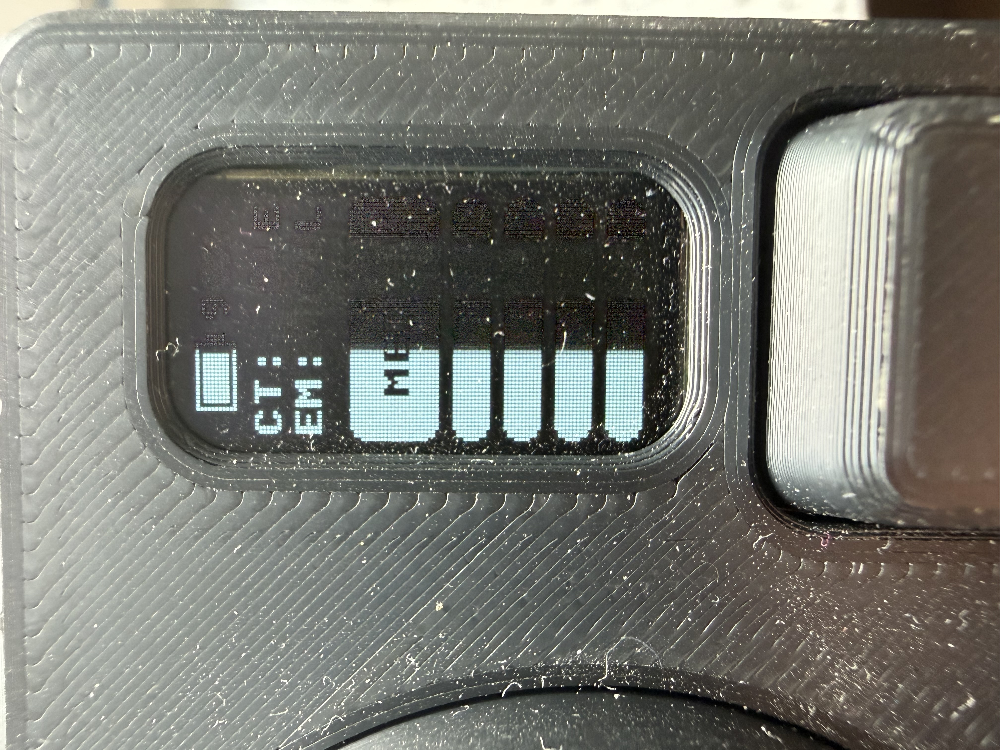

I knew this effect from an LTT video about nvidias pulsar technique on LCD monitors to decrease motion blur.
Quick google search, to explain it correctly:
This is **Backlight Strobing** or **Black Frame Insertion** (BFI)
> How it works: Instead of leaving the backlight or pixels on continuously (sample-and-hold), the display 
> briefly turns off the light or inserts a black frame between each real frame. This cuts down how long an 
> image stays visible on your retina, stopping the smear effect as your eyes track movement.

But the reason, why my OLED also inserts black bars, is probably that this is also the way, in which brightness
is controlled. (like over PWM) - Inserting black bars, between frames, is probably easier than dimming
the brightness of individual pixels... considering that the OLED is driven over I2C with limited bandwidth
and full array dimming mean that instead pushing a buffer with 1bpp it would require n/2 many bits per pixel
for n many brightness levels.

This also means, that I wont be able to change it (probably), only if I run the OLED at full eye-blinding brightness.

Sorry for nerding out about this. It is ok, if the time I spent on this work session, is not account for.
And it might not all be correct. I am speculating.

This effect is not visible by a human eye, because our eyes are exposed to light for a long time and are
sluggish. - So to get rid of the BFI, I just need to mimic the human eye, by exposing the sensor of my
camera to light for longer.

This is what shutter speed controls. But the problem is that I don't have control over it. This is why I told
you in the beginning that I couldn't use my phone.

My camera worked though. There I had full control over the shutter speed and took this picture with the white
background:


2. Layout picture: I screenshotted the top view of the keyboard in CAD (I use Autodesk Fusion)
with different render settings.
I put in the solid body view into photo shop with the visible edges and then overlayed another photo with a full
wire frame view with the same perspective and adjusted the coverage (Deckkraft auf Deutsch).
This results in a clear photo with faint internals of the macro keyboard.

Then I marked the important periphere with text and exported this pic:


3. For KiCanvas I needed to change the address to the path of my KiCad project root in order for KiCanvas to
find the PCB and schematic.


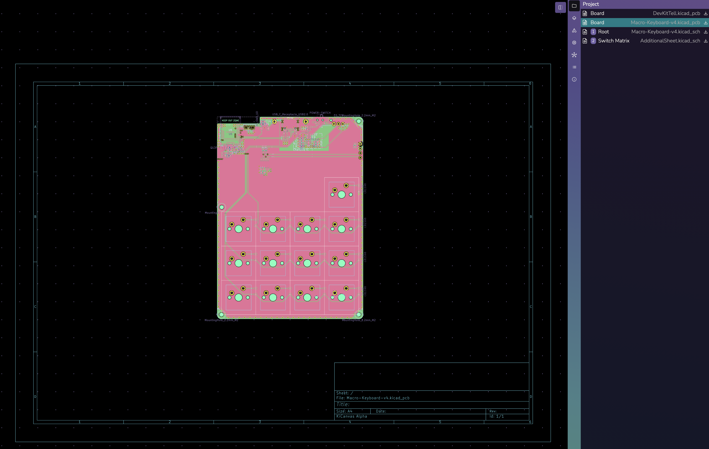

4. Lastly I changed some formatting in the README.

**tl;dr:** Took the hero picture of the macro keyboard, which made me discover the effect BFI has when
photographing it with a high shutter speed - was able to solve it by using my separate camera; created the 
layout photo by mashing together multiple view exports from my CAD; lastly fixed KiCanvas and did formatting.

**Time spent this session: 4 hours**


#### July 25: Adding licenses to the GitHub repo 

The ship requirement of horizons was to pic out and add a license to the repo. So I added two licenses!

This was actually pretty simple. I looked up common licenses for hardware projects and software projects
on GitHub. Especially the projects that went into my direction. For example, there is this one guy, who
built a [split keyboard](https://github.com/GEIGEIGEIST/TOTEM/tree/main?tab=readme-ov-file) based on the
Seeed Studio XIAO nRF52840 BLE or XIAO RP2040.
I actually discovered him a while ago (almost a year) when I first started with my project and was looking
for other people that also had a problem. Ever since seeing his sleek split keyboard, he has been a great
inspiration, even though he built a split keyboard instead of a macro keyboard.

And he chose the "CERN Open Hardware Licence Version 2" - which I also liked. It basically says:

> Anyone may study, modify, fabricate and sell your board. But if they distribute a modified design,
> or distribute a product made from it, they must make the complete corresponding design sources 
> available under CERN-OHL-S v2 too, keep your notices, and — where practicable — keep the source 
> location visible on the product's case (§4). So a company can build and sell your keypad, but they
> can't fork the PCB into a closed product.

So I chose this license for the hardware. Not for the whole repo, because I already use open source
firmware ZMK and I tailored and expanded it with modules, that could be very useful to other people.
For example: The OLED module. And the problems I had are documented (e.g. artifacting, custom screen
failing, anti aliased text that looked weird, assigning multiple bits to a 1bpp pixel or config I set
up was flipped back to default by just changing to the custom screen instead of the built in one)
Or an other example is the AS5600 driver that was adapted from Zephyr to work seamlessly with ZMK.
This can be used by other people and I don't need to be that strict there.

So for the Software part I chose the MIT license:
> Maximally permissive. Anyone can use, modify, sell, or close-source my ZMK module, driver and config;
> the only obligation is keeping my copyright line and the licence text with copies. I give no warranty
> and take no liability. It does not require anyone to publish their changes back to me. 

This is also the same license ZMK itself uses, so there's no friction there.

Sound good.

So I went onto https://ohwr.org/cern_ohl_s_v2.txt and opensource.org/license/mit and added them to
the Repo and explained the dual license structure in the README.md shortly:

> | Part | License | File |
> |---|---|---|
> | Firmware, ZMK config, scripts, docs (everything outside `hardware/`) | **MIT** | [LICENSE](./LICENSE) |
> | Hardware design — KiCad schematic/PCB, Gerbers, CAD/case, BOMs (everything in `hardware/`) | **CERN-OHL-S v2** | [hardware/LICENSE](./hardware/LICENSE) |

GitHub only detects a license at the repo root. It reads LICENSE there and nowhere else, so 
whichever license sits at root becomes the badge on the repo page and the value in the API.
The convention is: root = default, subdirectory = override. And in multi-license repos the root
file is read as covering everything not otherwise stated, and a LICENSE deeper in the tree scopes
that subtree. 
So hardware/LICENSE overriding for hardware/ is the pattern people expect, and it puts the CERN text
right next to the files it governs.

The one weakness of the current split could be that a root LICENSE invites the readers that MIT covers
hardware/ too, and someone who only reads the root file might not go looking for the override. 
But the README table from the top is what resolves that (or should).
(The usual fix is a short NOTICE file at root stating the split, rather than adding prose to LICENSE 
itself — but keeping LICENSE as pure license text is what keeps GitHub's detector happy...)

So this is why I landed on the structure.

**tl;dr:** I needed to add a license to the repo, so I was going through many licenses, especially
those assigned to similar projects. I added two licenses: CERN for hardware, MIT for firmware; 
I made sure nothing collides with other open source projects I use (e.g. ZMK) and ´I don't break to many
conventions with the license structure in the README (MIT as root and CERN as override for hardware
subpath).

**Time spent this session: 3 hours**


#### July 25: Adding the build guide

There is nothing special to it. There's no point in repeating what's already written there.
So I'll just add a few things I paid attention to:
1. I had to go through the entire process once—from ordering the PCB to verifying that everything works (+ add some nice pics along the way), which was time consuming, but gave me once again a nice overview on what producing the macro keyboard actually involves. (because the build guide rounds up nicely and pulls the whole repo togther). The overview comes from the round up, not by being high level and lacking detail (the guide doesn't lack important details).
2. I noticed some mistakes in other documents:
   - for example: The BOM_PCB.csv didn't mark the DNP components
   - or that I gave the bootloader a wrong attribute ("nice_nano" instead of the "MDBT50Q-1MV2") in the CLAUDE.md, so I changed that as well: Bootloader was right, but I said it belonged to a different board instead of exactly my MCU
3. In the README.md I forgot to declare that the local toolchain would need to be installed in order to build the firmware.
4. I came on the idea to just add build artifacts to the repo, so Users don't need to install a local toolchain. (only if they want to modify the firmware)
5. I also needed to explain why the bootloader is optional, what to do if you don't want to use one, and that the debugger was irrelevant and the two different versions of the firmware and what to do at each step, if one is chosen. 
6. Or the macOS scroll acceleration and what to do.

Just think every possible path through!

And then these are the mistakes you notice when you think through the users perspective and go though everything one by one.

There is much more to it and writing everything down and explaining it, would take a while, so this will do...

**tl;dr:** I added the build guide and made my way through the entire repository for all the different paths a user could take, which made me change more than just the build guide.

**Time spent this session: 6 hours**
