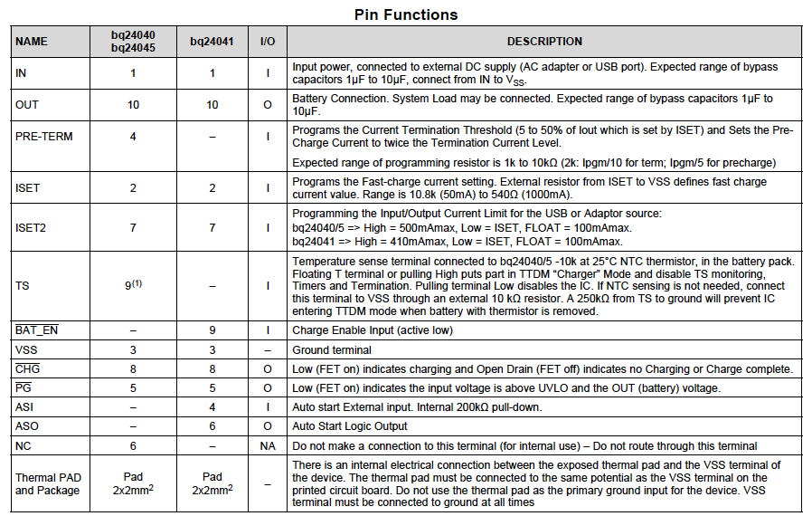
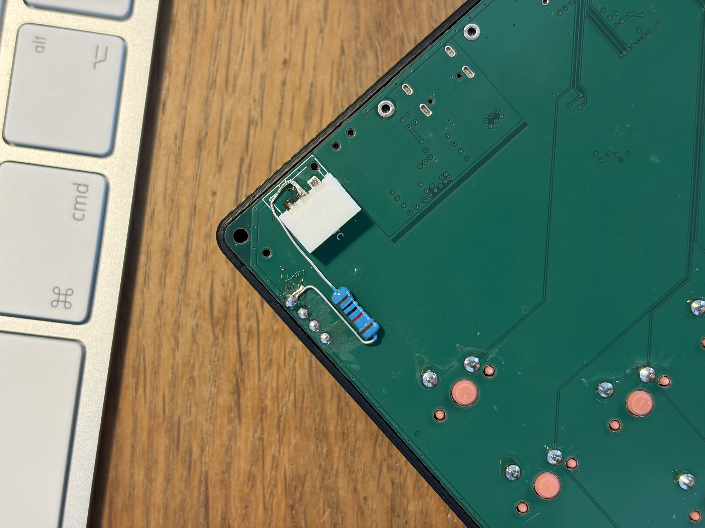
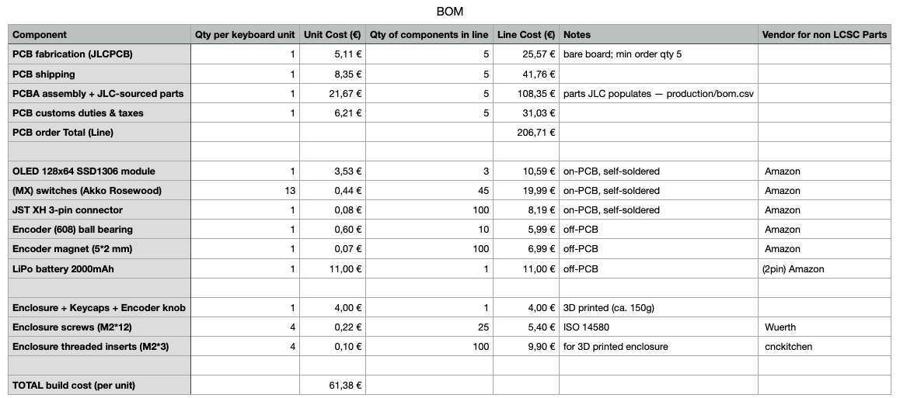

# Macro Keyboard — Build Journal

Devlog for my **Hack Club Horizons** hardware submission: a custom, wireless Bluetooth LE
macro keypad (12 keys + magnetic rotary encoder + OLED) built on an nRF52840
module and running ZMK.

Time is tracked with **Hackatime** (Wakatime → Hackatime) for firmware work since May.
Hardware/CAD/research sessions are recorded as **timelapses** (Lapse) and linked
per entry, since Lookout isn't supported for Horizons yet.

I actually started this project more than a year ago, and I've been documenting it the whole way — just not
in JOURNAL.md form. This file pulls all of that together into one devlog. It starts on May 23 because that's
the day I began tracking my time with Hackatime; plenty happened before then, I just wasn't logging the hours.

## Entries

#### May 23: Shorted my debugger probe - not my proudest journal entry

Back then I flashed firmware over SWD with a DAPLink probe instead of the UF2 bootloader (I moved to the
bootloader afterwards). Cortex-M 10-pin connector, pyocd, nothing fancy.

So one day I do the exact same thing I always do: connect the probe to the macro keyboard, kick off pyocd,
and... the progress bar just sits there and doesn't advance. No big deal — I unplug the probe, plug it back in,
re-run pyocd, and flash again.

And then the debugger probe starts smoking and then the little activity light that tells you something's happening just goes dark. RIP.

So what happened? Nothing was different from every other time I'd flashed this thing. The only way to
physically cook the probe like that is a mismatch on the connector pads. So I pulled up the schematic and
went pin by pin — the on-PCB connector vs. the probe's connector.

And then it hit me: I'd plugged the connector in from the *other* side of the PCB. Mirrored. That's the whole
story right there. I did that because I couldn't reach the other side - and I just didn't think through that this 10 pin 
connector with specific pins is not reversible like a USB port...

In the schematic you can see the nets that were *supposed* to line up, and (in my handwriting) the nets that
actually got connected once the plug was flipped around. Ground and 3V3 ended up on the same net → dead short
straight through the probe. Hence the smoke.

I reordered the debugger probe on amazon for 5€, so it could have been worse than just my probe shorting. If I shorted
the keypad or (worse) my mac, this would have been WAY worse.
It's still very embarrassing.

**tl;dr:** Flashed over SWD like always, but plugged the 10-pin Cortex-M connector in mirrored (from the wrong
side of the PCB). That put GND and 3V3 on the same net, shorted the probe, and let the debugger smoke. For the future I
will make sure to pay attention to the correct orientation of connectors.

**Time spent this session: 1.5 hours**

#### July 1: Fixed the LiPo not being charging

I got the LiPo battery of my macro keyboard to charge, so that's pretty neat.

Observation: When supplying the keypad with power, the charging indicator light up on the screen, but the
screen widget for the battery capacity would only show a static battery percentage.

What could cause this problem? Short answer:
1. Faulty screen indicator
2. Faulty resistors in the voltage divider
3. Charging IC not charging the LiPo: Could be due to something disabling the IC.

I was able to eliminate both cause #1 and #2 by measuring if the voltage of the battery increased when
supplying the charging IC. And it did not, this means the cap of the LiPo also stayed the same.
So it must be #3.

Because the ICs are usually fine, I looked into the schematic of the keyboard to see if I messed up something
there:

So I used the exact same IC before and it worked flawlessly. The only thing that I changed was that I made
use of the temperature sense terminal.
I looked into the datasheet of the IC and what could cause the charging IC to be disabled:

 

The TS (temperature-sense) is the BQ24040's veto over charging. When the NTCs resistance (changes
resistance with temperature of the bat pack) is not in the range that the BQ24040 likes, the battery is 
either to cold/absent or to hot. - Bc of safety, i wanted to implement it.
I measured TS-to-GND and got 237 kΩ. The key insight is from the datasheet is:
The IC pushes a fixed 50 µA through whatever's on TS and watches the *voltage*. At 50 µA a healthy 10 k NTC
sits around 0.5 V, dead center of the charge window. My 237 kΩ slams that node way
past the ~1.6 V "thermistor removed / freezing" threshold, so the IC decided
the battery was impossibly cold (or absent) and quietly disabled charging.

R6 is 240 k and it's supposed to sit in *parallel* with the pack's 10 k NTC → 10k ∥ 250k ≈ 9.6 kΩ.
If the NTC were actually in the circuit I could never measure *above* 10 k. Reading 237 k meant
the thermistor's return path was gone.

But why is the pack's NTC was never electrically present?
I asked Claude:
1. Either cold joints
2. BAT– isn't tied to the same GND R6 references → the NTC has no return path
3. The pack's third wire isn't a 10 k NTC.

And guess what? Yes, it was #3 again. I added the third wire (NTC) to the battery myself, because the battery
came without it. And I thought it was no problem as the BMS of the battery clearly labeled a third pad "NTC",
but it seems like the pad was just connected to no thermistor, because after measuring the resistance between
NTC and GND directly, there was none. Haha

Solution:
I don't need JEITA temp protection for the keypad to work (I will just get a LiPo with 3 wires the next time),
so I took the datasheet's sanctioned shortcut: a fixed 10 kΩ from TS to GND to pin the node back into the
normal window. In parallel with R6 that's ~9.6 kΩ → ~0.48 V on TS → charging
enabled.

Plugged in USB and the charge status finally went active — the pack is pulling
current for the first time.

**tl;dr:** LiPo wouldn't charge because the BQ24040's TS pin saw 237 kΩ (the
NTC was never in-circuit) and disabled charging. A 10 kΩ from TS to
GND put it back in range and enabled charging. For new keypads, I will just get the batteries with
3 wires.

**Time spent this session: 4 hours**

#### July 2: Wrote the BOM

I added and wrote BOMs (yes, plural) to fill some gaps in the repo and make the macro keyboard reproducible.

I noticed, that the shipping instructions for my project specifically ask for a bill of materials (BOM) to enable others to reproduce it. The current version doesn't have one, former ones had.

Why BOMs? - I landed on a multi-BOM structure (or idk how to call it):
- One BOM for PCBA under /hardware/PCB/KiCad/Macro-Keyboard-v4/production/bom.csv: After manufacturing the PCB, its populated with the components in this BOM. This step is the PCB assembly. Only the parts for this manufacturing steps are in this BOM. (e.g. nRf module, caps, resistors, usb port, etc.)
- PCB BOM under /hardware/BOM_PCB: Some of the parts, that need to be soldered onto the PCB, can't be soldered in the PCBA step, usually because those parts are to big. So I solder those manually. (e.g. key switches, OLED display, JST connector for LiPo - that's all)
The production BOM (for PCBA) captures only the parts for PCBA and the PCB BOM captures all of the parts, that need to be soldered onto the PCB, including the parts from PCBA.
- Master/build cost BOM: This BOM lists all of the on-PCB parts, which couldn't be populated with PCBA, + PCBA + the PCB itself (isn't included in neither PCB BOM or PCBA BOM) + all of the off-PCB parts. (e.g. enclosure + screws, the LiPo battery, bearings, keycaps, etc.)
This explains the structure. I will put this also in the README.md (probably in shorter form).

Only in the master/build cost BOM I added in the approximate costs for the components. I didn't also add prices to the PCB BOM, because PCBA cost might very, some components might need to be exchanged for other ones, tax and shipping costs can also change. Shipping cost, tax, customs duties are also listed as they are quite substantial.
In the end of the master BOM I calculated the approximate price per keyboard unit (without labour), which turned out to be about 61,38€. That could have been worse. But it needs to be said: If you somehow decide to build one on your own, you will end up paying more then just the price for one unit, because there are minimum ordere quantities for many components (above of what is needed for one keyboard unit). For example, the PCBs need to be ordered in quantity of 5 or above with JLCPCB.

To the main BOM I also added Notes to clarify in which group the components belong (on-PCB, on-PCB PCBA, off-PCB) beside the vendor.

Sorry that this is the only pic...

**tl;dr:** I added the BOMs, which gave me a good view on the hardware of this project.

**Time spent this session: 3 hours**
