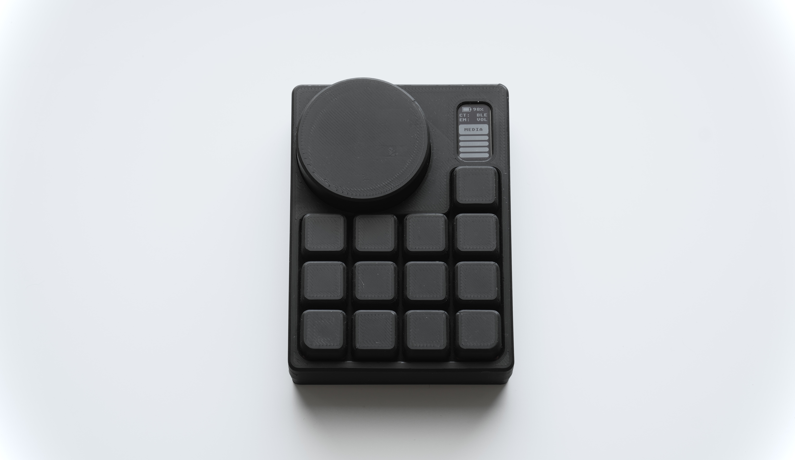
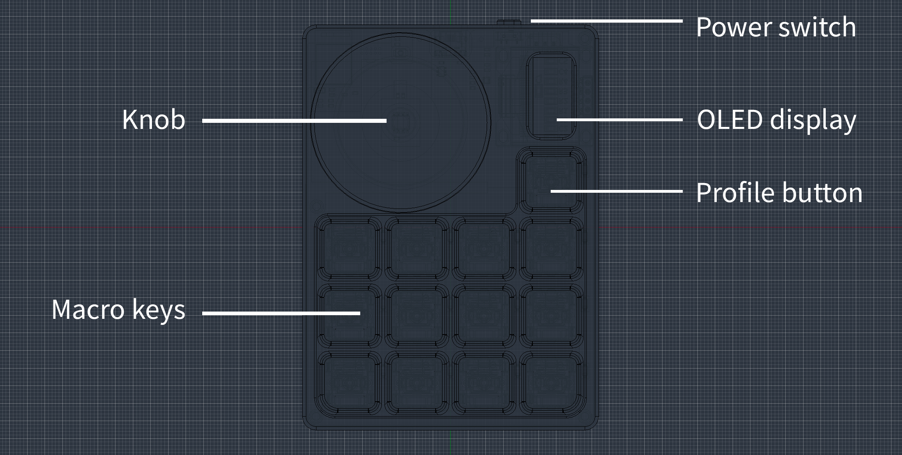

# Macro Keyboard

A custom, wireless **Bluetooth LE macro keypad** — 12 mechanical keys, a magnetic rotary
encoder, and a 128×64 OLED — built on a Nordic **nRF52840** module and running
[**ZMK**](https://zmk.dev). Keys and profiles are configurable live over ZMK
Studio; the encoder is a per-profile knob (volume / vertical scroll / horizontal
scroll / browser tabs). Battery-powered (2000 mAh LiPo) with USB-C charging.

This project was submitted to the **Hack Club Horizons** program. Its progress is logged
in [JOURNAL.md](./JOURNAL.md). The admission is still pending.



---

## What is a macro keyboard?

A macro keyboard is a **Human Interface Device** (HID), which executes **macros** on a connected
host computer. In this sense, it functions like a conventional keyboard, serving as the 
interface between human input and a computer action.

The difference between a standard keyboard and a macro keyboard lies in their respective 
functionalities. A standard keyboard performs "normal" key bindings (e.g., numbers, letters,
and function buttons), while a macro keyboard performs macros. These can be media keys 
(e.g., volume up/down, skip title), open applications on the host computer or executing 
entire commands, performing actions that would otherwise require **multiple keystrokes on a 
standard keyboard**.

This makes it easier to navigate the operating system by **removing friction** between the user
and the host.

## What is my macro keyboard and what does it do?

**My macro keyboard has 12 macro keys, a rotary magnetic encoder, an OLED display, is battery 
powered and supports up to 7 profiles.**

The **macro assigned to each key** can be configured **per profile**. Depending on which profile is 
active, a key can have up to seven different functions. Consequently, we can perform up to **84
different actions** with our 12 keys.

The **encoder mode** can also be configured. It can act as a **scroll wheel** in both vertical and
horizontal direction, control the **volume** or switch between browser tabs on the host. These **modes 
are bound to each profile** and can be changed by assigning a key on a profile, that cycles through 
the modes of the encoder. When moving to the next keypad profile, the encoder mode changes to the 
active profile's encoder mode. Returning to the previous profile will revert the encoder mode to its 
previous state.

The **OLED display** shows the selected keypad profile, the battery capacity, the connection mode, and 
the encoder mode.

You can think of the keypad profiles as the **user layer** of the macro keypad. These profiles are 
called the "keymap", and they are the layers where the macro keyboard's functionality is configured. 
This user layer live directly on the macro keyboard, so the macros stay **the same even when changing 
host devices.** A **profile** button on the macro keyboard is used to switch between profiles.

You can **configure** the keymap and profiles in real time without recompiling or reflashing the keypad 
through [**ZMK Studio**](https://zmk.studio), a graphical user interface for ZMK keyboard firmware.

The macro keyboard connects as a keypad **via Bluetooth** or **USB**. Hosts are cross-platform (Windows, 
macOS, Linux, and iOS). The keypad can be paired with up to five hosts and conveniently switch 
between them via assigned keys on the keymap.

## Layout



## Demo & photos

- **Demo video:** <!-- TODO: youtube video, that demonstrates  the functionality of the board --> 
- **Photos:** <!-- TODO: more photos -->


## Hardware overview

| | |
|---|---|
| **MCU** | Raytac MDBT50Q-1MV2 (nRF52840 Module) |
| **Input** | 12-key matrix with mx switches (3 rows × 4 cols) + 1 profile button |
| **Encoder** | AMS AS5600 magnetic rotary encoder (over I2C) |
| **Display** | 128×64 SSD1306 OLED (over I2C, with 1 bpp) |
| **Power** | 2000 mAh LiPo, BQ24040 charger, USB-C |
| **Enclosure** | 3D printed |

## Firmware overview

The macro keyboard runs custom ZMK Firmware, configured and built over a local toolchain.
> "ZMK Firmware is an open source (MIT) keyboard firmware built on the Zephyr™ Project Real Time Operating System (RTOS)." ([Introduction to ZMK](https://zmk.dev/docs))

Full toolchain and architecture notes are in [firmware/CLAUDE.md](./firmware/CLAUDE.md).

## Repository layout

```
macro_keyboard/
├── README.md               ← you are here
├── JOURNAL.md              ← build devlog
├── assets/journal-assets/  ← images referenced from the journal
├── firmware/
│   ├── CLAUDE.md               full firmware architecture & build notes
│   ├── IMPLEMENTATION_PLAN.md  milestone-by-milestone history
│   ├── zmk-config/             ZMK config: custom board files, module, 
│   │                           AS5600 driver, behaviors
│   └── zmk                     ZMK submodule (ZMK version for my toolchain)
└── hardware/
    ├── BOM.csv          build BOM
    ├── BOM_PCB.csv      per-component board BOM (JLCPCB SMT + hand-soldered)
    ├── BUILD.md         full build and assembly guide to reproduce the macro keyboard
    ├── PCB/KiCad/Macro-Keyboard-v4/   schematic, board, Gerbers, KiCad design files
    └── CASE/                          3D-printed enclosure (Fusion + mesh exports)
```

## Bill of Materials

- **[hardware/BOM.csv](./hardware/BOM.csv)** — **Master/build cost BOM**:
  PCB fabrication, JLCPCB assembly (the parts JLC populates), shipping, the on-PCB parts I 
  solder myself (OLED, key switches, JST, SWD header), and all off-PCB parts (encoder bearing/
  magnet/knob, battery, keycaps, enclosure, screws) with the approximated cost per element.
  -> in the end: what it cost to build one unit of my macro keypad.
- **[hardware/BOM_PCB.csv](./hardware/BOM_PCB.csv)** — **PCB BOM**:
  every component that physically sits on the board; some of the parts, that need to be soldered
  onto the PCB, can't be soldered in the PCBA step, usually because those parts are to big. So I
  solder those manually. (e.g. key switches, OLED display, JST connector for LiPo)
- **[production/bom.csv](./hardware/PCB/KiCad/Macro-Keyboard-v4/production/bom.csv)** — **PCBA BOM**: 
  After manufacturing the PCB, its populated with the components in this BOM. 
  This step is the PCB assembly. Only the parts for this manufacturing step are in this 
  BOM. (e.g. nRf module, caps, resistors, usb port, etc.)

Part numbers are given only for parts that can't be substituted; common passives (resistors, 
capacitors) are specified by value/footprint and left flexible. Prices are only in `BOM.csv`.

**Per-unit cost caveat:** JLCPCB sells PCBs in quantities of at least 5. 
The per-unit total in BOM.csv is the amortized build cost, meaning that building one yourself will
cost more than the per-unit cost alone.

## Schematic, PCB & Gerbers

- **Schematic (PDF):** [Macro-Keyboard-v4.pdf](./hardware/PCB/KiCad/Macro-Keyboard-v4/Macro-Keyboard-v4.pdf)
- **KiCad source:** [hardware/PCB/KiCad/Macro-Keyboard-v4/](./hardware/PCB/KiCad/Macro-Keyboard-v4/)
- **Gerbers:** [production/Macro-Keyboard-v4.zip](./hardware/PCB/KiCad/Macro-Keyboard-v4/production/Macro-Keyboard-v4.zip)
- **SMT Assembly:** [`bom.csv` + `positions.csv`](./hardware/PCB/KiCad/Macro-Keyboard-v4/production/)
- **Case:** [hardware/CASE/](./hardware/CASE/) — Fusion source + the meshes exported for 3D printing

[](https://kicanvas.org/?github=https://github.com/NikolasKelava/macro-keyboard/tree/main/hardware/PCB/KiCad/Macro-Keyboard-v4)

## Pinout

From the Macro-Keyboard-v4 schematic:

| Function | Net |
|---|---|
| Matrix columns | col0=P0.16, col1=P0.14, col2=P0.15, col3=P0.13 |
| Matrix rows | row0=P0.20, row1=P0.21, row2=P0.19 |
| I²C bus (OLED + AS5600) | SDA=P0.24, SCL=P0.25 |
| Profile button | P1.02 (diode to GND, polled) |
| Battery ADC | P0.04 (AIN2, ÷ voltage divider) |

## Firmware — build & flash

Full toolchain and architecture notes are in [firmware/CLAUDE.md](./firmware/CLAUDE.md).
In short (especially for reproducing the macro keyboard):

**Flashing:** I installed a Adafruit nRF52 bootloader on my board. With this bootloader I
can use UF2 drag and drop to flash the firmware by just double-tapping the reset button,
which mounts the keypad as a USB drive (`NRF52BOOT`), and then dragging `zmk.uf2` onto it - the build format for UF2 bootloaders. The board reflashes and reboots into the new firmware.

By default my pipeline will give both .hex and .uf2 build artifacts (that contain the
firmware) for flashing the macro keyboard. Flashing the .hex artifact over SWD with a 
debugger probe will work, but the macro keypad won't boot into the firmware!

This is because the UF2 bootloader sits right at the start of the flash partition. When 
flashing, the actual Zephyr firmware receives a place after the bootloader. It has an 
offset. The bootloader then points to the firmware when booting. When the keypad is in 
UF2 drag-and-drop mode (by double-tapping reset), the firmware after the bootloader in 
the partition is replaced. The cool thing I noticed is that the user-layer keymap won't 
be replaced because it's located farther away from the firmware. Therefore, you can 
update the firmware without losing your keymaps.

However, the defined offset for the bootloader will be applied to all artifacts when 
building the firmware. If no bootloader is installed on your macro keyboard and you flash 
via SWD, there won't be a bootloader to point to your firmware and boot it.

If you don't want to install a bootloader and want to flash the firmware directly with 
your debugger, read the section in [firmware/CLAUDE.md → Bootloader](../firmware/CLAUDE.md) "If the bootloader has to be removed".

**Build (from `firmware/zmk_toolchain/app`, ZMK toolchain):**

```bash
source /firmware/zmk_toolchain/.venv/bin/activate

west build -p -d build/macro_keyboard/m3 -b macro_keyboard -- \
  -DZMK_CONFIG="$PWD/../../zmk-config/config" \
  -DZMK_EXTRA_MODULES="$PWD/../../zmk-config/module"
```

Add `-S studio-rpc-usb-uart -DCONFIG_ZMK_STUDIO=y` for the ZMK Studio variant.
The build emits both `zmk.uf2` (drag-drop) and `zmk.hex` (SWD via `west flash -r pyocd`).

Before doing so: Follow the official [ZMK firmware document](https://zmk.dev/docs/development/local-toolchain/setup) on setting up the local Zephyr toolchain to build the ZMK firmware with macro_keyboard config. Install the current version of ZMK, which is added as a submodule to this repo. Install under the path `firmware/zmk_toolchain/`.

## Steps to reproduce

Full instructions: **[hardware/BUILD.md](./hardware/BUILD.md)**.

## Safety notes

- **LiPo battery (2000 mAh):** observe correct polarity; do not puncture, crush, or short. Charge
  only through the on-board **BQ24040** charger via USB-C. Disconnect and isolate a swollen or 
  damaged cell — do not charge it.
- The board periphere is **3.3 V** logic; do not back-feed 5 V into signal pins.
- Powered by USB-C — use a compliant cable/supply.

## AI disclosure

Firmware:
I used Claude Code when developing the firmware. It helped me with tasks such as setting up the ZMK 
firmware, configuring my custom board, writing additional modules for the OLED display and a AS5600 
driver, and behaviors. Especially for debugging, I used Claude Code.
Although it may sound like I completely handed over the firmware work to Claude, in a sense, this is
true. However, I am obviously deeply involved in the development and manage it. Claude's role is to 
speed up the process by taking over tedious tasks and also giving me good overviews on how things 
can be implemented.
I did the research on the available firmware choices and how to design the hardware around them.

Hardware:
The hardware portion of the project, which is the largest part of the project, was completely done 
without the use of an LLM or any other AI.

Anything that Hackclub specifically prohibited the use of AI for was done without it (e.g. this README.md).

## License

| Part | License | File |
|---|---|---|
| Firmware, ZMK config, scripts, docs (everything outside `hardware/`) | **MIT** | [LICENSE](./LICENSE) |
| Hardware design — KiCad schematic/PCB, Gerbers, CAD/case, BOMs (everything in `hardware/`) | **CERN-OHL-S v2** | [hardware/LICENSE](./hardware/LICENSE) |

If you reuse the hardware design, keep a notice like this with it:

```
Copyright (c) 2026 Nikolas Kelava
This source describes Open Hardware and is licensed under CERN-OHL-S v2.
You may redistribute and modify this source and make products using it under
the terms of CERN-OHL-S v2 (https://ohwr.org/cern_ohl_s_v2.txt).
This source is distributed WITHOUT ANY EXPRESS OR IMPLIED WARRANTY, INCLUDING
OF MERCHANTABILITY, SATISFACTORY QUALITY AND FITNESS FOR A PARTICULAR PURPOSE.
Please see the CERN-OHL-S v2 for applicable conditions.
Source location: https://github.com/NikolasKelava/macro-keyboard
```

Third-party code keeps its own license: [ZMK](https://github.com/zmkfirmware/zmk)
is MIT, the [Zephyr RTOS](https://github.com/zephyrproject-rtos/zephyr) is
Apache-2.0, and the [Adafruit nRF52 bootloader](https://github.com/adafruit/Adafruit_nRF52_Bootloader)
in `firmware/bootloader/` is MIT.
